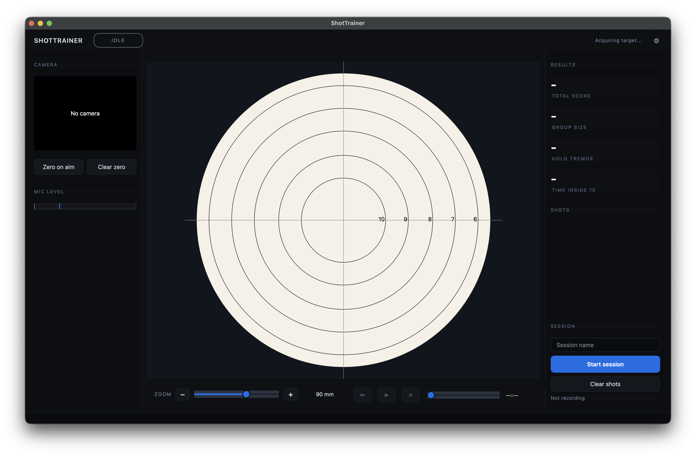
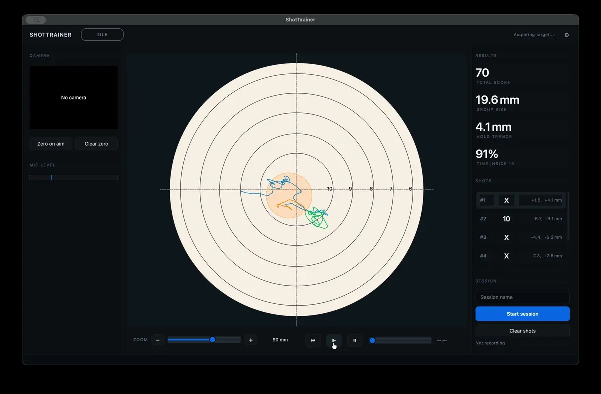

# ShotTrainer

ShotTrainer is a DIY hold-tracking and shot-scoring tool for shooting
practice. You bring your own camera and microphone, mount the camera
to your rifle's barrel or stock, and point it at a printed paper
target. As you aim around the target, the camera sees the target drift
through its frame, and ShotTrainer turns that drift into your rifle's
hold trace. The microphone picks up the shot, the trace freezes around
it, and the hit is marked on the digital target.

Useful for:

- Air rifle and air pistol dry-fire and live-fire practice.
- Smallbore (.22) practice at indoor and outdoor ranges.
- Coaching feedback on hold stability, follow-through and trigger
  release.
- Recording groups and shot timing for review and export.

Inspired by commercial optical trainers. Runs on Windows, macOS and Linux.

It is a personal/hobby project, not a product, and makes no accuracy
guarantees. See [`docs/accuracy.md`](docs/accuracy.md) for what is and
isn't achievable with this kind of setup, and
[`docs/cameras.md`](docs/cameras.md) for success and failure stories
with various cameras people have tried.

## Contents

- [What it does](#what-it-does)
- [Preview](#preview)
- [How it's set up](#how-its-set-up)
- [Documentation](#documentation)
- [Installing](#installing)
  - [Windows](#windows)
  - [macOS](#macos)
  - [Linux](#linux)
- [Running](#running)
  - [Keyboard shortcuts](#keyboard-shortcuts)
- [Status](#status)
- [Requirements](#requirements)
- [Development](#development)
  - [Project layout](#project-layout)
- [Contributing](#contributing)
- [Tracking](#tracking)
- [Packaging](#packaging)
- [Troubleshooting](#troubleshooting)
- [Licence](#licence)

## What it does

- Live preview of what the barrel-mounted camera sees.
- Live aim tracking against a known-diameter printed circle, with no
  separate calibration step.
- Audio shot detection from a microphone.
- Automatic ring scoring against your selected target face.
- Records the rifle's hold trace continuously while practising.
- Stores sessions and shots in a local SQLite database.
- Lets you replay the trace around each shot.

## Preview

App preview:


Trace replay view:


## How it's set up

1. Print the marker sheet from `Tools > Print marker sheet` and pin it
   at your shooting position, or use any printed target whose black
   aiming circle has a known diameter (NSRA, ISSF and other federation
   targets all work. The built-in face presets cover common ones).
2. Mount a small USB webcam to the rifle barrel or stock so it looks
   forward at the printed circle.
3. In `Preferences > Target > Tracking circle`, set the diameter to
   match the printed value. ShotTrainer derives the mm/px scale from
   each frame's detected radius, so the trace is correct in millimetres
   from the first sample on.
4. Aim, shoot, repeat. The trace and hit position appear in real time.

## Documentation

- [Setup and camera alignment](docs/setup.md)
- [How tracking works](docs/how-tracking-works.md)
- [Accuracy and target sizing](docs/accuracy.md)
- [Cameras tested](docs/cameras.md)
- [Using federation targets (NSRA, ISSF)](docs/provided-targets.md)
- [Architecture](docs/architecture.md)
- [Tracking and the printed circle](docs/calibration.md)
- [Engineering notes](docs/engineering-notes.md)
- [Troubleshooting](docs/troubleshooting.md)
- [Releases and upgrades](docs/releases.md)

The same docs are published as a site at
<https://dsgnr.github.io/ShotTrainer/> via GitHub Pages.

## Installing

Pre-built downloads are attached to each tagged release on
[GitHub releases](https://github.com/dsgnr/ShotTrainer/releases).
Pick the one for your platform.

### Windows

1. Download `ShotTrainer-Setup.exe` from the latest release.
2. Run it and follow the installer.
3. Launch ShotTrainer from the Start menu.

A portable `ShotTrainer-Windows.zip` is also published. Unzip
anywhere and run `ShotTrainer.exe` from the unpacked folder if you'd
rather not install.

### macOS

1. Download `ShotTrainer-macOS.dmg` from the latest release.
2. Open the .dmg and drag **ShotTrainer.app** into your Applications
   folder.
3. The first launch will prompt for camera and microphone access. Allow
   both.

The app isn't yet signed by an Apple Developer ID, so on first launch
macOS may show "ShotTrainer can't be opened because Apple cannot check
it for malicious software". Right-click the app and pick **Open** to
override. MacOS remembers the choice from then on.

### Linux

1. Download `ShotTrainer-Linux.tar.gz` from the latest release.
2. Extract somewhere convenient: `tar -xzf ShotTrainer-Linux.tar.gz`.
3. Run `./ShotTrainer/ShotTrainer`.

You'll need access to `/dev/video*` (usually via the `video` group)
and a working PortAudio install (PulseAudio or ALSA). On Wayland you
may need the X11 plugin if PySide6 cannot find a working Wayland
platform plugin on your system.

## Running

```bash
shottrainer
```

When running from source via `uv`:

```bash
uv run shottrainer
```

### Keyboard shortcuts

- `Ctrl+S` (`Cmd+S` on macOS): start or stop the current session.
- `Ctrl+R` (`Cmd+R`): clear the displayed shots (only when not recording).
- `Space`: play / pause replay when a shot is selected.

## Status

The app boots, runs the live preview, detects shots, records sessions,
and replays the trace around each shot. Tracking measures pixel offsets
against a printed circle of known diameter on every frame, so distance
changes self-correct without a recalibration step. Preferences include
camera rotation and mirroring, audio gain and sensitivity, target face
selection, and pre/post-shot windows. The stats
panel shows shot group metrics live, plus hold tremor, trace length, and
time-in-ring percentages over the pre-shot window of the selected shot. See
[`docs/troubleshooting.md`](docs/troubleshooting.md) for the rough edges and
[`docs/engineering-notes.md`](docs/engineering-notes.md) for trade-offs.

## Requirements

- Python 3.13 or newer (only for source installs, not for the packaged builds).
- A webcam, ideally with manual focus and decent zoom.
- A microphone within hearing range of the firing point.
- Operating system: Windows, macOS, or Linux.

On macOS you will be prompted for camera and microphone permissions the first
time the app runs. On Linux the user must be in the appropriate `video` and
`audio` groups, or have access to `/dev/video*` and ALSA/PulseAudio.

## Development

ShotTrainer uses [uv](https://docs.astral.sh/uv/) for Python and
dependency management.

```bash
uv sync         # install runtime + dev dependencies in .venv/
make test       # run the pytest suite
make lint       # ruff check
make run        # launch the app from source
```

See [`CONTRIBUTING.md`](CONTRIBUTING.md) for the full contributor
workflow, the conventional commit rules, the pre-commit hook setup and
the documentation build.

### Project layout

```
src/shottrainer/
    app/         entry point, controller, settings, paths
    ui/          PySide6 widgets and dialogs
    tracking/    camera capture, target detection, live tracker
    audio/       microphone input and shot detection
    sessions/    database, models, repository
    replay/      trace replay logic
    services/    coordination between subsystems
docs/            engineering notes, accuracy notes, troubleshooting
packaging/       Nuitka build script and platform notes
tests/           pytest suite
```

See [`docs/architecture.md`](docs/architecture.md) for a longer description.

## Contributing

Bug reports, fixes, target faces and tested-camera reports are all
welcome. The full guide lives in [`CONTRIBUTING.md`](CONTRIBUTING.md).
Branch off `main`, run `make test` and `make lint` before pushing, 
use conventional commit prefixes (`feat:`, `fix:`, `refactor:`, 
`docs:`, `test:`), and open a pull request describing what
changed and how you tested.

## Tracking

The live tracker measures the position and radius of a printed black
circle every frame. The vector from the frame's centre to the circle's
centre is the rifle's aim offset in pixels. Dividing by the detected
radius and multiplying by the user-supplied diameter (set in
**Preferences → Target → Tracking circle**) converts that to
millimetres on the target plane. There is no separate calibration step.

If the camera moves slightly closer or further from the target between
sessions, the circle's pixel size changes and the mm/px scale follows
it automatically. See [`docs/calibration.md`](docs/calibration.md) for
detail.

## Packaging

Nuitka builds the standalone bundle under `packaging/`. The README in
that directory covers platform-specific notes (PySide6 plugins, OpenCV
bundling, signing, DMG and Inno Setup installer).

## Troubleshooting

See [`docs/troubleshooting.md`](docs/troubleshooting.md) for the common
issues with cameras, microphones, tracking, and replay.

## Licence

GPL-3.0-or-later. See [`LICENCE`](LICENCE).
