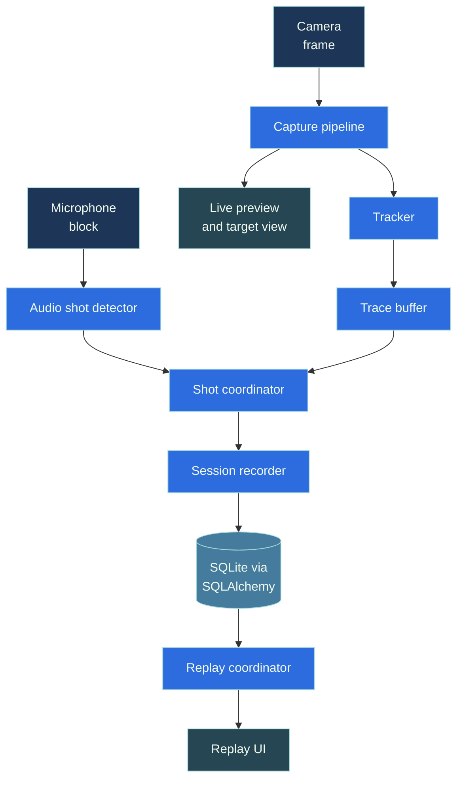

# Architecture

ShotTrainer is split into small modules with clear responsibilities. Each
subsystem can be tested in isolation, and Qt signals connect them at the edges.

## High level

The UI never talks to the camera or audio backends directly. It listens to
high level signals from the services layer (new tracking sample, shot
detected, session saved) and reads from the repository when displaying past
sessions.

## Module boundaries

Arrows point from depends-on to depended-upon. ``ui/`` and ``app/``
are the only modules that import Qt. Everything below the controller
is pure Python so it tests cleanly with synthetic data.

## Threads

Camera capture and audio capture each run on their own thread. Tracking and
shot detection happen close to the capture loop to keep latency low. Results
are pushed back to the UI thread via Qt's queued signal/slot connections so
nothing blocks the event loop.

## Modules

- `tracking/` Camera capture, target detection, the live tracker that
  converts detections into millimetre coordinates. Pure functions where
  possible so they can be tested with synthetic images.
- `audio/` Microphone input and shot detection. Configurable threshold and
  refractory window.
- `sessions/` SQLAlchemy models, repository, schema migrations.
- `services/` Coordinates capture, tracking, audio, and storage. Pure
  Python, no Qt. The UI talks to this layer.
- `replay/` Loads and steps through stored traces for playback.
- `ui/` PySide6 widgets and dialogs. Thin layer. Widgets only render and
  expose signals.
- `app/` Entry point, controller (the place Qt signals meet pure-Python
  services), settings, paths, persisted UI state.

## Persistent state files

These live under the platform-appropriate data directory (see
`docs/troubleshooting.md` if you need to find them):

- `sessions.db` SQLite database with sessions, shots, and trace samples.
- `settings.json` user preferences (camera id, rotation, flips, audio
  device, sensitivity, target face, recording windows). The file is
  watched while the app is running. External edits are picked up live.
- `detector_settings.json` last auto-optimised detector parameters.
- `zero_offset.json` user-set zero offset that shifts the trace origin
  to match the rifle's actual aim or zeroed group centre.
- `ui_state.json` window geometry and splitter sizes.

Each file degrades gracefully if missing or corrupt. The app falls back to
defaults rather than failing to start.

## Why detection lives outside the capture loop

The original sketch had everything inside the camera loop. Pulling
detection and coordinate conversion out of the capture loop makes them
testable without OpenCV or a real camera, and means the same
conversion logic is used at record time, replay time, and when
re-analysing past sessions.

## Replaceable parts

- The detector is one class with a small surface, so a different
  algorithm can be slotted in without touching the tracker or UI.
- The repository hides SQLAlchemy from the rest of the code, so a different
  storage backend can be substituted by reimplementing the same methods.
- The audio backend is hidden behind a thin interface so PortAudio can be
  swapped where it isn't available.
