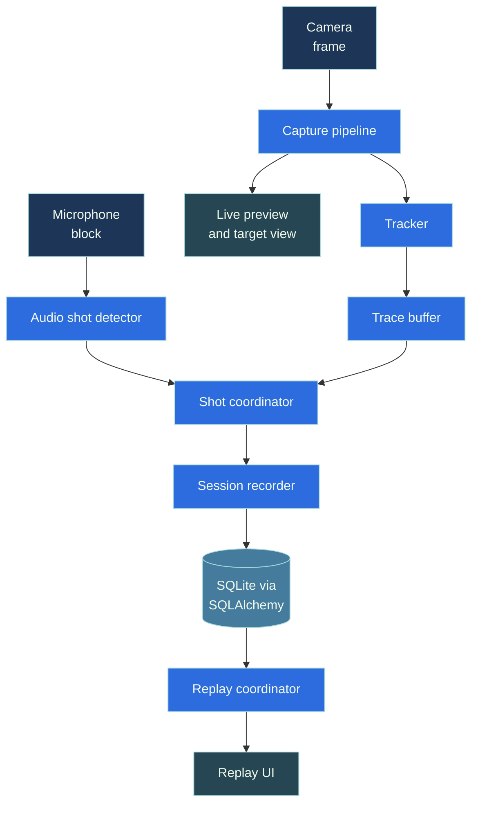
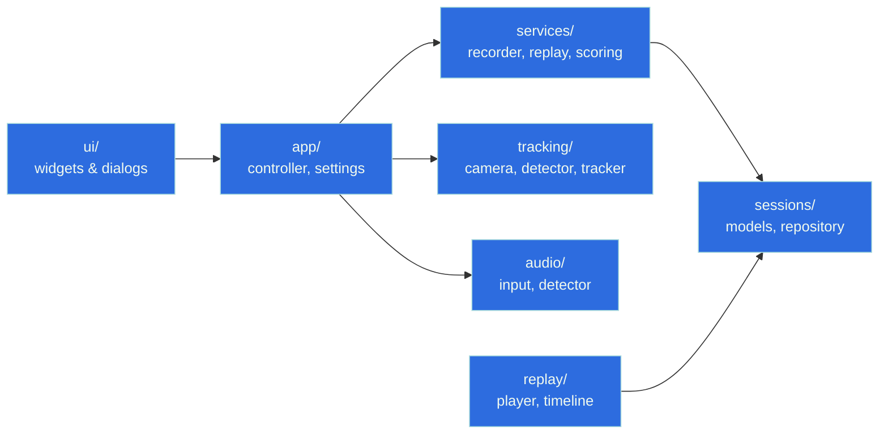

# Architecture

This page provides a high-level overview of how ShotTrainer is organised
internally.

The application is split into small, focused modules with clear
responsibilities. Most of the core logic is implemented independently of the
user interface, making it easier to test, maintain, and extend.

## High-level overview

The user interface does not communicate directly with camera or audio hardware.

Instead, it listens for high-level events such as:

- New tracking samples
- Shot detections
- Session updates
- Replay events

This keeps hardware-specific code separate from the presentation layer.

## Module dependencies

The arrows indicate dependency direction.

Higher-level modules depend on lower-level modules, but not the other way
around.

In general:

- `ui/` depends on `app/`
- `app/` coordinates the rest of the system
- `services/` implements application behaviour
- `tracking/`, `audio/`, and `sessions/` provide specialised functionality

## Design principles

A few architectural decisions guide the structure of the project:

- User interface code is kept separate from domain logic.
- Hardware access is isolated behind small interfaces.
- Most functionality can be tested without a camera, microphone, or Qt.
- Data storage is accessed through repositories rather than directly from UI
  code.
- Components communicate through signals and events rather than direct coupling.

## Threading model

Camera capture and audio capture run independently on their own worker threads.

This allows frame acquisition and audio processing to continue without blocking
the user interface.

Results are sent back to the main thread using Qt's queued signal and slot
system, ensuring that all UI updates occur safely on the GUI thread.

## Module overview

### `tracking/`

Responsible for:

- Camera capture
- Target detection
- Coordinate conversion
- Tracking sample generation

The tracking code is designed to be testable with synthetic images wherever
possible.

### `audio/`

Responsible for:

- Audio device input
- Shot detection
- Threshold handling
- Refractory window logic

### `sessions/`

Responsible for:

- Database models
- Data persistence
- Repository implementations
- Database migrations

This module is the application's storage layer.

### `services/`

Coordinates the application's core behaviour, including:

- Recording sessions
- Replay
- Scoring
- Trace management
- Session lifecycle management

The user interface communicates primarily with this layer.

### `replay/`

Responsible for:

- Loading recorded sessions
- Managing replay timelines
- Stepping through recorded trace data

### `ui/`

Contains:

- PySide6 widgets
- Dialogs
- Window layouts
- User interaction code

The UI layer focuses on presentation and user interaction rather than
application logic.

### `app/`

Contains:

- Application startup code
- Controllers
- Settings management
- Path management
- Persistent UI state

This is where the Qt application and the core services are connected together.

## Persistent data

ShotTrainer stores data in a small number of files within its data directory.

For platform-specific locations, see [Troubleshooting](troubleshooting.md).

### `sessions.db`

SQLite database containing:

- Sessions
- Shots
- Tracking samples

### `settings.json`

User preferences, including:

- Camera settings
- Audio settings
- Target settings
- Recording settings

Changes made outside the application are detected and reloaded automatically.

### `detector_settings.json`

Stores the most recent detector optimisation settings.

### `zero_offset.json`

Stores the user's zero offset used by the **Zero on aim** feature.

### `ui_state.json`

Stores window layouts, geometry, splitter positions, and other user interface
state.

If any of these files are missing or invalid, ShotTrainer falls back to sensible
defaults rather than failing to start.

## Why tracking and detection are separate

Tracking, detection, and coordinate conversion are implemented as separate
components rather than being embedded directly in the camera capture loop.

This provides several advantages:

- Individual components can be tested independently.
- Detection logic can be replaced without changing the tracker.
- The same coordinate conversion code can be reused during recording, replay,
  and analysis.
- Camera hardware is not required for most automated tests.

## Replaceable components

Several parts of the system are intentionally designed to be interchangeable.

### Detector

The target detector is isolated behind a small interface, making it possible to
experiment with different detection algorithms without affecting the rest of the
application.

### Storage backend

The repository layer hides SQLAlchemy details from higher-level code.

In principle, a different storage implementation could be introduced without
changing the UI or services layers.

### Audio backend

Audio capture is abstracted behind a lightweight interface so alternative
backends can be supported if PortAudio is unavailable on a particular platform.
