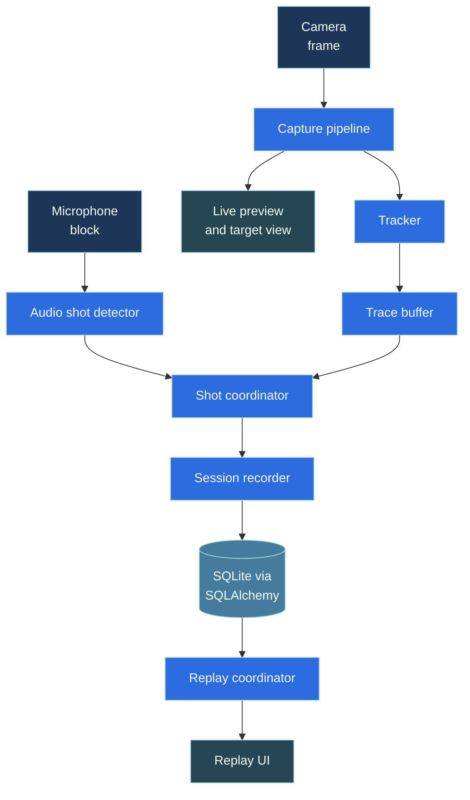
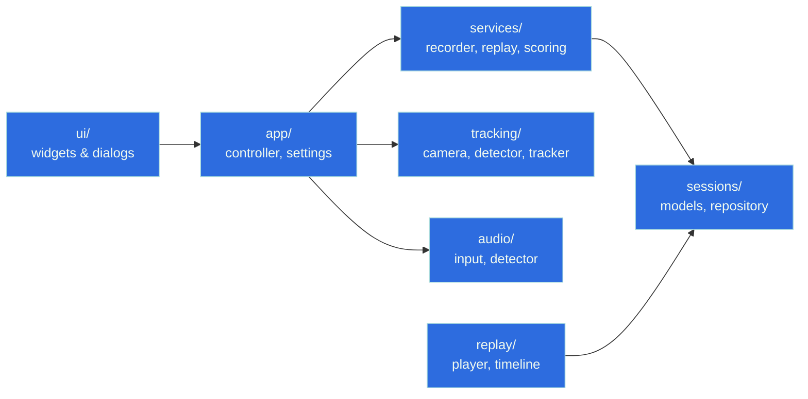

# Architecture

This page provides a high-level overview of how ShotTrainer is organised
internally.

The application is split into small, focused modules with clear
responsibilities. Most of the core logic is implemented independently of the
user interface, making it easier to test, maintain, and extend.

## High-level overview


```mermaid
flowchart TB
    Cam[Camera<br/>frame] --> Pipeline[Capture pipeline]
    Pipeline --> Tracker[Tracker]
    Tracker --> Buffer[Trace buffer]
    Pipeline --> Preview[Live preview<br/>and target view]

    Mic[Microphone<br/>block] --> Detector[Audio shot detector]
    Detector --> ShotCoord[Shot coordinator]
    Buffer --> ShotCoord
    ShotCoord --> Recorder[Session recorder]
    Recorder --> DB[(SQLite via<br/>SQLAlchemy)]

    DB --> Replay[Replay coordinator]
    Replay --> ReplayUI[Replay UI]

    classDef capture fill:#1d3557,stroke:#a8dadc,color:#f1faee;
    classDef domain fill:#2d6cdf,stroke:#a8dadc,color:#f1faee;
    classDef store fill:#457b9d,stroke:#a8dadc,color:#f1faee;
    classDef ui fill:#264653,stroke:#a8dadc,color:#f1faee;
    class Cam,Mic capture;
    class Pipeline,Tracker,Buffer,Detector,ShotCoord,Recorder,Replay domain;
    class DB store;
    class Preview,ReplayUI ui;
```

The user interface does not communicate directly with camera or audio hardware.

Instead, it listens for high-level events such as:

- New tracking samples
- Shot detections
- Session updates
- Replay events

This keeps hardware-specific code separate from the presentation layer.

## Module dependencies


```mermaid
flowchart LR
    UI[ui/<br/>widgets &amp; dialogs] --> App[app/<br/>controller, settings]
    App --> Services[services/<br/>recorder, replay, scoring]
    App --> Tracking[tracking/<br/>camera, detector, tracker]
    App --> Audio[audio/<br/>input, detector]
    Services --> Sessions[sessions/<br/>models, repository]
    Replay[replay/<br/>player, timeline] --> Sessions

    classDef layer fill:#2d6cdf,stroke:#a8dadc,color:#f1faee;
    class UI,App,Services,Tracking,Audio,Sessions,Replay layer;
```

The arrows indicate dependency direction.

Higher-level modules depend on lower-level modules, but not the other way
around.

In general:

- `ui/` depends on `app/`
- `app/` coordinates the rest of the system
- `services/` implements application behaviour
- `tracking/`, `audio/`, and `sessions/` provide specialised functionality

## Design principles

A few architectural decisions guide the structure of the project:

- User interface code is kept separate from domain logic.
- Hardware access is isolated behind small interfaces.
- Most functionality can be tested without a camera, microphone, or Qt.
- Data storage is accessed through repositories rather than directly from UI
  code.
- Components communicate through signals and events rather than direct coupling.

## Threading model

Camera capture and audio capture run independently on their own worker threads.

This allows frame acquisition and audio processing to continue without blocking
the user interface.

Results are sent back to the main thread using Qt's queued signal and slot
system, ensuring that all UI updates occur safely on the GUI thread.

## Module overview

### `tracking/`

Responsible for:

- Camera capture
- Target detection
- Coordinate conversion
- Tracking sample generation

The tracking code is designed to be testable with synthetic images wherever
possible.

### `audio/`

Responsible for:

- Audio device input
- Shot detection
- Threshold handling
- Refractory window logic

### `sessions/`

Responsible for:

- Database models
- Data persistence
- Repository implementations
- Database migrations

This module is the application's storage layer.

### `services/`

Coordinates the application's core behaviour, including:

- Recording sessions
- Replay
- Scoring
- Trace management
- Session lifecycle management

The user interface communicates primarily with this layer.

### `replay/`

Responsible for:

- Loading recorded sessions
- Managing replay timelines
- Stepping through recorded trace data

### `ui/`

Contains:

- PySide6 widgets
- Dialogs
- Window layouts
- User interaction code

The UI layer focuses on presentation and user interaction rather than
application logic.

### `app/`

Contains:

- Application startup code
- Controllers
- Settings management
- Path management
- Persistent UI state

This is where the Qt application and the core services are connected together.

## Rust workspace

A Cargo workspace under `crates/` holds Rust implementations of the storage,
scoring, statistics, services, settings, audio, tracking and controller code.
The Tauri application in `src-tauri/` runs them behind a placeholder page, and
the released interface remains in Python. The Python code under
`src/shottrainer/` is the reference for behaviour. The Rust crates read and
write the same `sessions.db`, JSON files and CSV exports.

| Crate        | Contents                                                                                                                                         |
| ------------ | ------------------------------------------------------------------------------------------------------------------------------------------------ |
| `tracking`   | Frames and frame transforms, detector settings and the circle detector, the auto-optimise search, the tracker and camera capture                 |
| `audio`      | Shot detector, block pipeline and microphone input                                                                                               |
| `core`       | Sessions database, migrations and repository, scoring, statistics, trace buffer, shot and replay coordinators, session recorder and CSV exporter |
| `settings`   | Data paths, preferences, detector, zero offset, camera and window state stores and the target face catalogue                                     |
| `controller` | The application controller, session, replay, preferences and device management, without an interface framework                                   |
| `app`        | The Tauri shell in `src-tauri/` with the webview commands and events, the frame channel, device access prompts and fake devices                  |
| `testkit`    | Test helpers for loading golden fixtures and comparing floats                                                                                    |

The Rust `SessionRecorder` holds only its batching state. Each method that
writes takes a `SessionRepository` argument, so the recorder can live beside
the connection and move between threads. The replay window is the free function
`shot_window` in `services::replay_coordinator`, which also takes the
repository per call.

Import rules between the crates:

- `tracking`, `audio` and `settings` import no other workspace crate.
- `core` imports only `tracking` and `audio`.
- `controller` imports the four library crates and no JSON or interface
  library.
- `testkit` is used only from tests.
- `app` imports every library crate and is the only crate that imports Tauri.
- No other crate imports a UI framework.

The Python `sessions` and `services` modules depend on each other through
scoring, so `core` holds both and the Python `app` stores live in `settings`.

### Audio crate

The `audio` crate has three layers.

- `ShotDetector` is the high-pass filter, threshold and refractory logic ported
  from the Python detector. It takes one block of samples and a block start
  time and returns at most one shot.
- `AudioPipeline` takes interleaved device buffers, reads channel 0 as the
  Python input does when it opens one channel, cuts blocks of
  `block_size` frames and emits `AudioEvent::Level` for each block followed by
  `AudioEvent::Shot` when the detector fires. A trailing partial frame is
  dropped. The detector runs at the rate of the incoming buffers, whatever the
  configured `sample_rate` says.
- `AudioInput` opens a microphone through `cpal` on its own thread and feeds
  the pipeline from the audio callback. It selects the device by default,
  index or name, picks a mono configuration at the configured rate when the
  device offers one and otherwise falls back to the device rate and channel
  count. `list_audio_inputs` returns the input device names.

Events reach the caller through one callback. A failed open or play yields one
`Error` and nothing else. Otherwise `Started` is the first event, `Error` may
arrive any number of times while the stream runs and `Stopped` is emitted
exactly once by `stop()` or on drop. If the stream thread cannot be spawned the
`Error` is delivered on the caller's thread before `start` returns. A new
`block_size` passed to `update_settings` applies from the next block that is
cut, whereas Python fixes it when the stream opens.

The clock is supplied by the caller as a `ClockFn` returning seconds on the
shared monotonic timeline. The pipeline reads it once per buffer, treats the
reading as the arrival time of the buffer's last frame and derives each block
start from the frame count, so shot timestamps are on the same timeline as
camera frames.

Signals in the audio fixtures are integer recipes made of seeded noise and
dyadic-valued segments. `scripts/generate_golden.py` renders them with numpy
float32 and the Rust tests render them with `f32`, so both sides see identical
samples and no sample arrays are stored. The `shot_detector` and
`audio_pipeline` fixtures are listed under golden fixtures below.

The `audio_input` example opens a real microphone and prints levels and shots.
It needs a device and microphone permission, so it is run by hand and not by
`cargo test`.

```bash
cargo run -p shottrainer-audio --example audio_input -- default 10
```

### Tracking crate

The `tracking` crate has five layers. Only the last one needs a camera.

- `Frame` holds a BGR or grey 8-bit image. The transforms in `frame_ops` port
  the Python helpers. Greyscale conversion uses OpenCV's generic fixed-point
  formula on every platform. opencv-python on Apple silicon uses KleidiCV's
  15-bit coefficients, which can differ from it by one level.
- `TargetDetector` is the trait for finding the target circle in a frame.
  `DetectorSettings` and the arithmetic shared by detector implementations live
  in `detector`.
- `Tracker` turns detections into `TrackingSample` values. It applies the
  pixel to millimetre conversion and the zero offset, and rejects non-finite
  diameters.
- The auto-optimise search in `tuning` scores candidate settings through the
  `HoughScorer` trait. An empty grid falls back to the base settings.
- `CameraCapture` reads frames from a `FrameSource` on its own thread and
  delivers `CameraEvent` values through one callback. `Opened` comes first and
  frames are numbered from 1. An `Error` may follow, and `Closed` is emitted
  exactly once unless an event callback panics. No frame is delivered after a
  stop request, but `Closed` still is. A device that finishes opening after
  the stop request is released without an `Opened` event. If the capture
  thread does not finish within the stop timeout of 5 seconds it is detached
  rather than terminated. The caller supplies a `ClockFn` returning seconds on
  the shared monotonic timeline, the same one the audio pipeline uses.

The `opencv` cargo feature is off by default, so `cargo test --workspace` and
default builds never compile OpenCV. It adds `cv::CircleTargetDetector`,
`cv::tuning::OpenCvHoughScorer`, `CameraCapture::start` and
`cv::camera::probe_cameras`. It needs OpenCV 4 or 5 and libclang. OpenCV 5
moved the contour geometry functions into a separate `geometry` module, so
`build.rs` reads the major version from the OpenCV headers and sets
`cfg(opencv_5)`. The `SHOTTRAINER_OPENCV_MAJOR` environment variable overrides
the detection. A CI job builds and tests the feature on Ubuntu and macOS, but
it is allowed to fail because the distribution versions are not pinned. The
Ubuntu OpenCV 4.6 build has not been checked against the fixtures.

macOS asks for camera permission only when the request comes from the main
thread, so the crate does not request it and the app has to make the request
at start-up. A plain terminal process cannot open a camera through the
`camera_capture` example unless the terminal itself has been granted access.

The `camera_capture` example opens a camera, runs the circle detector on each
frame and prints a line about once a second. It needs a camera, so it is run
by hand and not by `cargo test`.

```bash
cargo run -p shottrainer-tracking --features opencv --example camera_capture -- 0 5
```

### Controller crate

The `controller` crate ports `AppController` and its camera, preferences and
session managers. A `Controller` owns the database connection, the loaded
preferences and target faces, the frame pipeline and tracker, the session
recorder, the replay player and the device managers. It handles one `Input` at
a time, either a `Command` from the front end or a tagged device event, and
reports everything through `UiEvent` values passed to one callback. Prompts
that ask the user to confirm, and the session browser and Preferences dialogs
themselves, belong to the front end, so a destructive command arrives already
confirmed.

`ControllerHandle::spawn` runs the controller on its own thread. Commands and
device events share one queue, so they are handled in arrival order. The thread
also wakes when the replay player's next step is due and every 1.5 seconds to
check `settings.json` for edits made outside the application. If the thread
panics, the callback receives `UiEvent::ControllerFailed` with the reason and
`ControllerHandle::is_running` returns false, as it does after a normal
shutdown. The application asks for camera and microphone access before calling
`start`, because macOS only shows the prompt for a request made on the main
thread.

`Controller::new` emits the preferences and zero offset events on the thread
that calls it, before a front end can be listening. The front end sends
`Command::Refresh` once it is, and again after reloading its view, to receive
the preferences with their rings, the zero offset, the session state and the
shot list.

The camera, the microphone, the circle detector and the optimiser's Hough
scorer are reached through the `CameraBackend`, `AudioBackend`,
`TargetDetector` and `HoughScorer` traits, so the crate is tested with fakes.
`Backends::system()` is available with the `opencv` feature and uses OpenCV for
the camera and detector and `cpal` for the microphone. OpenCV has no device
names, so cameras are listed as `Camera 0`, `Camera 1` and so on, and a camera
saved by name from the Python application is found again by its saved index.
Listing cameras opens each index below 5 in turn, so it only happens when the
front end asks for the device list, or at start-up for a selection that has a
name and no index. A saved index is opened directly, and a refreshed list
reports the camera that is running without opening it again.

Behaviour that differs from the Python controller:

- Each camera or microphone start gets a new generation number, and events
  from an earlier generation are ignored.
- At most two camera frames wait for the controller. Later frames are dropped
  at the capture thread until the controller catches up, where Python processed
  every frame on the capture thread.
- A detection with a non-finite value is treated as not found, so it cannot
  leave NaN in the tracker's moving averages.
- Preferences sent by the front end are checked with the same per-value rules
  as `settings.json`. A new session with an unknown category is recorded as
  `practice`, and changing a saved session to an unknown category is refused.
- Saving the Preferences dialog compares the new values with the ones from
  when the dialog opened, so a change made only through the live preview, such
  as brightness, contrast, rotation or flips, is saved. Python compares with
  the preview-modified values and loses such a change. A second
  `BeginPreview` keeps the first restore point.
- A non-finite brightness or contrast and a rotation other than 0, 90, 180 or
  270 sent as a preview value are ignored.
- Repeated identical warnings from the detector, the frame transform and trace
  sample writes are logged once and then every 300th time.

### Application shell

The `shottrainer-app` crate in `src-tauri/` is the Tauri application. It owns
one `ControllerHandle` and translates between the controller and the webview.
The page in `frontend/` is a placeholder that draws camera frames and lists
recent events until the web front end is written.

The webview calls these Tauri commands:

| Command              | Effect                                                                                                                   |
| -------------------- | ------------------------------------------------------------------------------------------------------------------------ |
| `send_command`       | Forwards one controller command, such as `{"type": "deleteShot", "index": 2}`                                            |
| `frontend_ready`     | Sends `Command::Refresh`, so a page that has just registered its listeners receives the state it missed                  |
| `subscribe_frames`   | Registers the channel that receives camera pixels                                                                        |
| `frame_drawn`        | Reports one pixel packet drawn                                                                                           |
| `controller_status`  | Whether the controller runs, why it could not start, whether fake devices are in use and which device access was refused |
| `restart_controller` | Replaces a stopped controller with a new one                                                                             |

Every `UiEvent` is emitted as the Tauri event `ui-event` with a camelCase JSON
payload tagged by `type`, for example `{"type": "audioLevel", "level": 0.12}`.
Numbers that are not finite arrive as `null`. A command whose JSON does not
match the expected shape is refused before it reaches the controller.

A camera frame produces a `frame` event with the overlay and the trace point,
which keeps the trace in order with the other events, and a binary packet on
the frame channel with the pixels. The packet is a 32 byte little-endian header
followed by RGBA rows from the top.

| Offset | Type  | Field                                                                                   |
| ------ | ----- | --------------------------------------------------------------------------------------- |
| 0      | `u32` | Width                                                                                   |
| 4      | `u32` | Height                                                                                  |
| 8      | `i64` | Frame id, matching the `frame` event                                                    |
| 16     | `f64` | Capture time in seconds on the controller clock                                         |
| 24     | `f64` | Send time in milliseconds since the Unix epoch, for latency checks against `Date.now()` |

At most two packets wait for `frame_drawn`. Pixels for later frames are
dropped until the page reports one drawn, and their `frame` events are still
sent. Subscribing a new channel, as a reloaded page does, forgets the packets
sent to the old one.

The controller is created in Tauri's `setup` hook and opens no device. On
macOS the shell then asks for camera and microphone access on the main thread
and calls `ControllerHandle::start` once both prompts are answered. Refused
access is listed by `controller_status`. Other platforms start at once. If the
database cannot be opened, the error is kept and returned by
`controller_status` and by every command. If the controller thread panics,
the page receives `controllerFailed`, commands return an error and
`restart_controller` starts a new controller. On exit the shell shuts the
controller down, which saves a running recording.

With `--fake-devices`, with `SHOTTRAINER_FAKE_DEVICES` set to `1`, `true` or
`yes`, or in a build without the `opencv` feature, the shell uses fake devices.
A synthetic camera draws a dark circle that drifts around the frame centre, a
simple detector finds it by its dark pixels, and the microphone reports a quiet
level with a shot every 5 seconds. Fake devices keep their database and
settings in `ShotTrainer-fake-devices` under the system temporary directory, so
they never touch the user's data.

The bundle identifier is `org.shottrainer.app`, as in the Nuitka build, because
macOS stores camera and microphone consent per identifier. The Tauri CLI warns
that an identifier ending in `.app` is not recommended. `Info.plist` carries
the camera and microphone usage strings from the Python packaging.

### Golden fixtures

Behaviour that has to match Python is fixed by JSON fixtures in
`testdata/golden/`. Each fixture is generated from the Python implementation by
`scripts/generate_golden.py`, and the Rust tests load it through `testkit`.
The available names are `preferences`, `scoring`, `shot_stats`, `trace`,
`export_csv`, `stores`, `target_faces`, `shot_detector`, `audio_pipeline`,
`frame_ops`, `tracker`, `detector_tuning` and `detector`. The `detector`
generator also writes the PNG frames in `testdata/frames/detector/`, and those
tests only run with the `opencv` feature. To regenerate one and check the Rust
side against it:

```bash
uv run python scripts/generate_golden.py scoring
cargo test --workspace
```

Keep fixtures compact, with one case per line, and choose boundary cases over
exhaustive combinations. The largest fixture, `trace.json`, is about 215 KB.
Floating-point comparisons use a tolerance of `1e-9`, so a case whose result
can be zero also asserts the sign explicitly.

### Compatibility checks

- Schema migrations are tested against databases built from the SQL dumps in
  `testdata/legacy/`, one per schema version. `scripts/make_legacy_db.py`
  writes the dumps from historical DDL it hard-codes and does not import
  `shottrainer`.
- A database whose `schema_meta` table exists but has no row is treated as
  version 1, migrated and then stamped with the current version. Python stamps
  the current version without migrating, which leaves an old layout unreadable.
  The migration steps check the columns first, so a current layout is left
  unchanged.
- `crates/core/examples/write_fixture_db.rs` writes a database and CSV export
  through the Rust repository and exporter. `scripts/check_rust_db.py` opens
  that database with the Python `SessionRepository`, checks counts, categories,
  shot order, `NULL` millimetre values and datetimes, and compares the CSV files
  with the Python exporter byte for byte. Run it with temporary paths only:

  ```bash
  cargo run -q -p shottrainer-core --example write_fixture_db -- \
    /tmp/rust_fixture.db /tmp/rust_fixture_csv > /tmp/rust_fixture.json
  uv run python scripts/check_rust_db.py \
    /tmp/rust_fixture.db /tmp/rust_fixture.json /tmp/rust_fixture_csv
  ```

  The script prints `ok` on success. Remove the temporary files afterwards.
- Tests never touch the real data directory.

See [`CONTRIBUTING.md`](https://github.com/dsgnr/ShotTrainer/blob/main/CONTRIBUTING.md)
for the Rust format, lint and test commands.

## Persistent data

ShotTrainer stores data in a small number of files within its data directory.

For platform-specific locations, see [Troubleshooting](troubleshooting.md).

### `sessions.db`

SQLite database containing:

- Sessions
- Shots
- Tracking samples

### `settings.json`

User preferences, including:

- Camera settings
- Audio settings
- Target settings
- Recording settings

Changes made outside the application are detected and reloaded automatically.

### `detector_settings.json`

Stores the most recent detector optimisation settings.

### `zero_offset.json`

Stores the user's zero offset used by the **Zero on aim** feature.

### `ui_state.json`

Stores window layouts, geometry, splitter positions, and other user interface
state.

If any of these files are missing or invalid, ShotTrainer falls back to sensible
defaults rather than failing to start.

## Why tracking and detection are separate

Tracking, detection, and coordinate conversion are implemented as separate
components rather than being embedded directly in the camera capture loop.

This provides several advantages:

- Individual components can be tested independently.
- Detection logic can be replaced without changing the tracker.
- The same coordinate conversion code can be reused during recording, replay,
  and analysis.
- Camera hardware is not required for most automated tests.

## Replaceable components

Several parts of the system are intentionally designed to be interchangeable.

### Detector

The target detector is isolated behind a small interface, making it possible to
experiment with different detection algorithms without affecting the rest of the
application.

### Storage backend

The repository layer hides SQLAlchemy details from higher-level code.

In principle, a different storage implementation could be introduced without
changing the UI or services layers.

### Audio backend

Audio capture is abstracted behind a lightweight interface so alternative
backends can be supported if PortAudio is unavailable on a particular platform.
