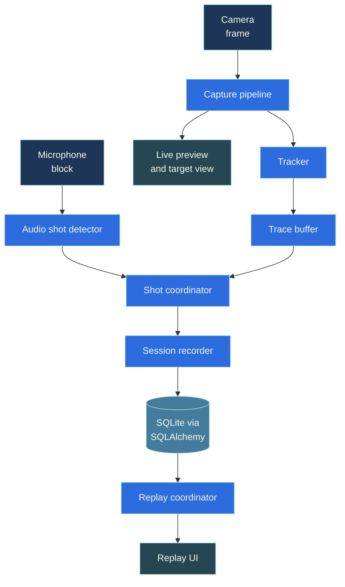
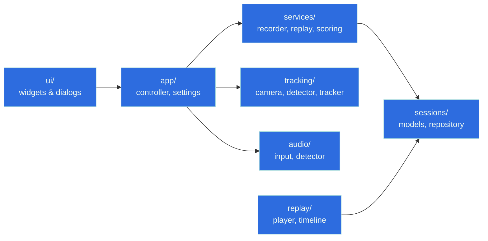

# Architecture

This page provides a high-level overview of how ShotTrainer is organised
internally.

The application is split into small, focused modules with clear
responsibilities. Most of the core logic is implemented independently of the
user interface, making it easier to test, maintain, and extend.

## High-level overview


```mermaid
flowchart TB
    Cam[Camera<br/>frame] --> Pipeline[Capture pipeline]
    Pipeline --> Tracker[Tracker]
    Tracker --> Buffer[Trace buffer]
    Pipeline --> Preview[Live preview<br/>and target view]

    Mic[Microphone<br/>block] --> Detector[Audio shot detector]
    Detector --> ShotCoord[Shot coordinator]
    Buffer --> ShotCoord
    ShotCoord --> Recorder[Session recorder]
    Recorder --> DB[(SQLite via<br/>SQLAlchemy)]

    DB --> Replay[Replay coordinator]
    Replay --> ReplayUI[Replay UI]

    classDef capture fill:#1d3557,stroke:#a8dadc,color:#f1faee;
    classDef domain fill:#2d6cdf,stroke:#a8dadc,color:#f1faee;
    classDef store fill:#457b9d,stroke:#a8dadc,color:#f1faee;
    classDef ui fill:#264653,stroke:#a8dadc,color:#f1faee;
    class Cam,Mic capture;
    class Pipeline,Tracker,Buffer,Detector,ShotCoord,Recorder,Replay domain;
    class DB store;
    class Preview,ReplayUI ui;
```

The user interface does not communicate directly with camera or audio hardware.

Instead, it listens for high-level events such as:

- New tracking samples
- Shot detections
- Session updates
- Replay events

This keeps hardware-specific code separate from the presentation layer.

## Module dependencies


```mermaid
flowchart LR
    UI[ui/<br/>widgets &amp; dialogs] --> App[app/<br/>controller, settings]
    App --> Services[services/<br/>recorder, replay, scoring]
    App --> Tracking[tracking/<br/>camera, detector, tracker]
    App --> Audio[audio/<br/>input, detector]
    Services --> Sessions[sessions/<br/>models, repository]
    Replay[replay/<br/>player, timeline] --> Sessions

    classDef layer fill:#2d6cdf,stroke:#a8dadc,color:#f1faee;
    class UI,App,Services,Tracking,Audio,Sessions,Replay layer;
```

The arrows indicate dependency direction.

Higher-level modules depend on lower-level modules, but not the other way
around.

In general:

- `ui/` depends on `app/`
- `app/` coordinates the rest of the system
- `services/` implements application behaviour
- `tracking/`, `audio/`, and `sessions/` provide specialised functionality

## Design principles

A few architectural decisions guide the structure of the project:

- User interface code is kept separate from domain logic.
- Hardware access is isolated behind small interfaces.
- Most functionality can be tested without a camera, microphone, or Qt.
- Data storage is accessed through repositories rather than directly from UI
  code.
- Components communicate through signals and events rather than direct coupling.

## Threading model

Camera capture and audio capture run independently on their own worker threads.

This allows frame acquisition and audio processing to continue without blocking
the user interface.

Results are sent back to the main thread using Qt's queued signal and slot
system, ensuring that all UI updates occur safely on the GUI thread.

## Module overview

### `tracking/`

Responsible for:

- Camera capture
- Target detection
- Coordinate conversion
- Tracking sample generation

The tracking code is designed to be testable with synthetic images wherever
possible.

### `audio/`

Responsible for:

- Audio device input
- Shot detection
- Threshold handling
- Refractory window logic

### `sessions/`

Responsible for:

- Database models
- Data persistence
- Repository implementations
- Database migrations

This module is the application's storage layer.

### `services/`

Coordinates the application's core behaviour, including:

- Recording sessions
- Replay
- Scoring
- Trace management
- Session lifecycle management

The user interface communicates primarily with this layer.

### `replay/`

Responsible for:

- Loading recorded sessions
- Managing replay timelines
- Stepping through recorded trace data

### `ui/`

Contains:

- PySide6 widgets
- Dialogs
- Window layouts
- User interaction code

The UI layer focuses on presentation and user interaction rather than
application logic.

### `app/`

Contains:

- Application startup code
- Controllers
- Settings management
- Path management
- Persistent UI state

This is where the Qt application and the core services are connected together.

## Rust workspace

A Cargo workspace under `crates/` holds Rust implementations of the storage,
scoring, statistics, services and settings code. Camera capture, target
detection, the tracker, the controller and the interface are not part of the
workspace yet and remain in Python. The Python code under `src/shottrainer/`
is the reference for behaviour. The Rust crates read and write the same
`sessions.db`, JSON files and CSV exports.

| Crate      | Contents                                                                                                                                         |
| ---------- | ------------------------------------------------------------------------------------------------------------------------------------------------ |
| `tracking` | Shared tracking value types such as `TrackingSample`                                                                                             |
| `audio`    | Shot detector, block pipeline and microphone input                                                                                               |
| `core`     | Sessions database, migrations and repository, scoring, statistics, trace buffer, shot and replay coordinators, session recorder and CSV exporter |
| `settings` | Data paths, preferences, detector, zero offset, camera and window state stores and the target face catalogue                                     |
| `testkit`  | Test helpers for loading golden fixtures and comparing floats                                                                                    |

The Rust `SessionRecorder` holds only its batching state. Each method that
writes takes a `SessionRepository` argument, so the recorder can live beside
the connection and move between threads. The replay window is the free function
`shot_window` in `services::replay_coordinator`, which also takes the
repository per call.

Import rules between the crates:

- `tracking`, `audio` and `settings` import no other workspace crate.
- `core` imports only `tracking` and `audio`.
- `testkit` is used only from tests.
- No crate imports a UI framework.

The Python `sessions` and `services` modules depend on each other through
scoring, so `core` holds both and the Python `app` stores live in `settings`.

### Audio crate

The `audio` crate has three layers.

- `ShotDetector` is the high-pass filter, threshold and refractory logic ported
  from the Python detector. It takes one block of samples and a block start
  time and returns at most one shot.
- `AudioPipeline` takes interleaved device buffers, reads channel 0 as the
  Python input does when it opens one channel, cuts blocks of
  `block_size` frames and emits `AudioEvent::Level` for each block followed by
  `AudioEvent::Shot` when the detector fires. A trailing partial frame is
  dropped. The detector runs at the rate of the incoming buffers, whatever the
  configured `sample_rate` says.
- `AudioInput` opens a microphone through `cpal` on its own thread and feeds
  the pipeline from the audio callback. It selects the device by default,
  index or name, picks a mono configuration at the configured rate when the
  device offers one and otherwise falls back to the device rate and channel
  count. `list_audio_inputs` returns the input device names.

Events reach the caller through one callback. A failed open or play yields one
`Error` and nothing else. Otherwise `Started` is the first event, `Error` may
arrive any number of times while the stream runs and `Stopped` is emitted
exactly once by `stop()` or on drop. If the stream thread cannot be spawned the
`Error` is delivered on the caller's thread before `start` returns. A new
`block_size` passed to `update_settings` applies from the next block that is
cut, whereas Python fixes it when the stream opens.

The clock is supplied by the caller as a `ClockFn` returning seconds on the
shared monotonic timeline. The pipeline reads it once per buffer, treats the
reading as the arrival time of the buffer's last frame and derives each block
start from the frame count, so shot timestamps are on the same timeline as
camera frames.

Signals in the audio fixtures are integer recipes made of seeded noise and
dyadic-valued segments. `scripts/generate_golden.py` renders them with numpy
float32 and the Rust tests render them with `f32`, so both sides see identical
samples and no sample arrays are stored. The `shot_detector` and
`audio_pipeline` fixtures are listed under golden fixtures below.

The `audio_input` example opens a real microphone and prints levels and shots.
It needs a device and microphone permission, so it is run by hand and not by
`cargo test`.

```bash
cargo run -p shottrainer-audio --example audio_input -- default 10
```

### Golden fixtures

Behaviour that has to match Python is fixed by JSON fixtures in
`testdata/golden/`. Each fixture is generated from the Python implementation by
`scripts/generate_golden.py`, and the Rust tests load it through `testkit`.
The available names are `preferences`, `scoring`, `shot_stats`, `trace`,
`export_csv`, `stores`, `target_faces`, `shot_detector` and `audio_pipeline`.
To regenerate one and check the Rust side against it:

```bash
uv run python scripts/generate_golden.py scoring
cargo test --workspace
```

Keep fixtures compact, with one case per line, and choose boundary cases over
exhaustive combinations. The largest fixture, `trace.json`, is about 215 KB. Floating-point comparisons use a tolerance of `1e-9`,
so a case whose result can be zero also asserts the sign explicitly.

### Compatibility checks

- Schema migrations are tested against databases built from the SQL dumps in
  `testdata/legacy/`, one per schema version. `scripts/make_legacy_db.py`
  writes the dumps from historical DDL it hard-codes and does not import
  `shottrainer`.
- A database whose `schema_meta` table exists but has no row is treated as
  version 1, migrated and then stamped with the current version. Python stamps
  the current version without migrating, which leaves an old layout unreadable.
  The migration steps check the columns first, so a current layout is left
  unchanged.
- `crates/core/examples/write_fixture_db.rs` writes a database and CSV export
  through the Rust repository and exporter. `scripts/check_rust_db.py` opens
  that database with the Python `SessionRepository`, checks counts, categories,
  shot order, `NULL` millimetre values and datetimes, and compares the CSV files
  with the Python exporter byte for byte. Run it with temporary paths only:

  ```bash
  cargo run -q -p shottrainer-core --example write_fixture_db -- \
    /tmp/rust_fixture.db /tmp/rust_fixture_csv > /tmp/rust_fixture.json
  uv run python scripts/check_rust_db.py \
    /tmp/rust_fixture.db /tmp/rust_fixture.json /tmp/rust_fixture_csv
  ```

  The script prints `ok` on success. Remove the temporary files afterwards.
- Tests never touch the real data directory.

See [`CONTRIBUTING.md`](https://github.com/dsgnr/ShotTrainer/blob/main/CONTRIBUTING.md)
for the Rust format, lint and test commands.

## Persistent data

ShotTrainer stores data in a small number of files within its data directory.

For platform-specific locations, see [Troubleshooting](troubleshooting.md).

### `sessions.db`

SQLite database containing:

- Sessions
- Shots
- Tracking samples

### `settings.json`

User preferences, including:

- Camera settings
- Audio settings
- Target settings
- Recording settings

Changes made outside the application are detected and reloaded automatically.

### `detector_settings.json`

Stores the most recent detector optimisation settings.

### `zero_offset.json`

Stores the user's zero offset used by the **Zero on aim** feature.

### `ui_state.json`

Stores window layouts, geometry, splitter positions, and other user interface
state.

If any of these files are missing or invalid, ShotTrainer falls back to sensible
defaults rather than failing to start.

## Why tracking and detection are separate

Tracking, detection, and coordinate conversion are implemented as separate
components rather than being embedded directly in the camera capture loop.

This provides several advantages:

- Individual components can be tested independently.
- Detection logic can be replaced without changing the tracker.
- The same coordinate conversion code can be reused during recording, replay,
  and analysis.
- Camera hardware is not required for most automated tests.

## Replaceable components

Several parts of the system are intentionally designed to be interchangeable.

### Detector

The target detector is isolated behind a small interface, making it possible to
experiment with different detection algorithms without affecting the rest of the
application.

### Storage backend

The repository layer hides SQLAlchemy details from higher-level code.

In principle, a different storage implementation could be introduced without
changing the UI or services layers.

### Audio backend

Audio capture is abstracted behind a lightweight interface so alternative
backends can be supported if PortAudio is unavailable on a particular platform.
