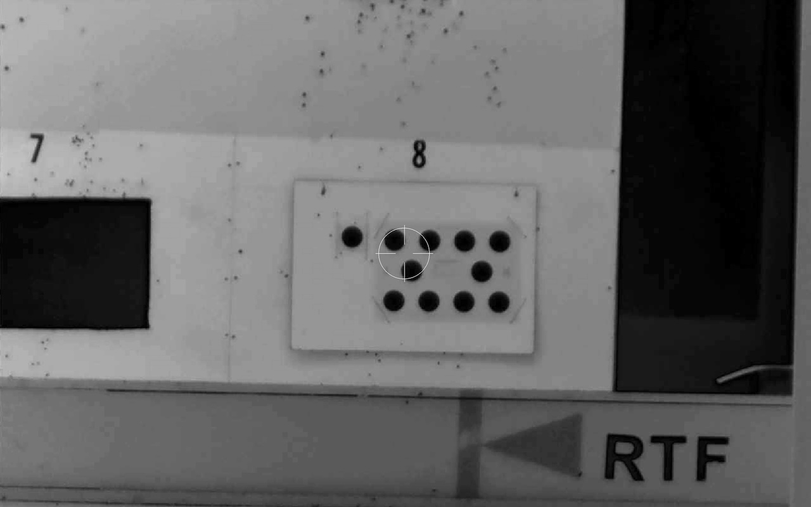

# Arducam OV9281 (USB, Global Shutter)

| Field               | Value                                                 |
| ------------------- | ----------------------------------------------------- |
| Manufacturer        | Arducam                                               |
| Model               | B0332 (1MP OV9281 Global Shutter, no microphones)     |
| Sensor / resolution | OV9281, 1280 x 800, monochrome, global shutter        |
| Connection          | USB 2.0 (UVC, plug-and-play)                          |
| Frame rate          | Up to 120 fps @ 1280x800 MJPEG                        |
| Lens mount          | M12 (interchangeable)                                 |
| Approximate price   | ~£30-40 + lenses                                      |
| Tested by           | [@dsgnr](https://github.com/dsgnr){:target="\_blank"} |

## Why this camera

I picked this camera for two reasons. It has a global shutter and it supports
interchangeable lenses.

Rolling shutter on a normal camera exposes each row of pixels at a slightly
different time. When the rifle is moving (shouldering, transitioning onto
target, recoil) the image shears and the circle the detector finds isn't quite
the right shape. Global shutter exposes the whole sensor at once, so the
geometry is always correct regardless of how fast the rifle is moving. The hope
is that the detector will hold lock through movements that would occasionally
cause a dropout on a rolling shutter camera.

The sensor is monochrome. There's no
[Bayer filter](https://en.wikipedia.org/wiki/Bayer_filter) (the colour mosaic
that sits over a normal camera sensor and blocks most of the light hitting each
pixel so it only sees red, green, or blue). Every pixel on this sensor sees all
the light that hits it, which means better sensitivity and sharper edges in
greyscale. ShotTrainer converts to greyscale before detection anyway, so nothing
useful is lost. The circle edge should read slightly cleaner in the threshold
step compared to a colour sensor at the same resolution.

120 fps at full resolution (1280x800). 1MP sounds low on paper but ShotTrainer
only needs enough pixels across the tracking circle for a stable centroid, not a
sharp photograph. The low resolution is what allows the high frame rate over USB
2.0, and 4x more frames per second than a typical 30 fps camera should mean
smoother traces and tighter shot timing. Whether that actually matters for
coaching or just looks nicer is something to evaluate.

### Lenses tried

| Lens                        | FoV (approx)       | Holder needed | Notes                               |
| --------------------------- | ------------------ | ------------- | ----------------------------------- |
| Stock (wide-angle)          | ~70 deg horizontal | 9 mm (stock)  | Useless past ~2 m                   |
| [16 mm M12](#16mm-m12-lens) | 27 deg horizontal  | 9 mm (stock)  | Not usable for 25 yard NSRA targets |
| [50 mm M12](#50mm-m12-lens) | ~8 deg             | 16 mm         | Needs taller holder                 |

Tests below are at a 25 yards indoor range. LED lighting, standard NSRA 25 yard
card (NSRA 2510 BM/89-18) on firing point 8 (rightmost).

Specifications below are from manufacturer specs. FOV is converted to the OV9281
sensor.

#### 16mm M12 lens

Useless at 25 yards.

Spec:

| Specification | Value                                            |
| ------------- | ------------------------------------------------ |
| Focal Length  | 16mm                                             |
| Aperture      | F2.0                                             |
| FOV (DxHxV)   | 16.4° × 13.9° × 8.8° (5.6m x 3.5m x 6.6m at 25y) |

#### 50mm M12 lens

Each black target is 51.5mm, and this works out to ~33px for the tracker. This
is probably usable with a single target on the card, but unlikely to get
"millimetre accuracy". Needs to be tested properly on the rifle.

Spec:

| Specification | Value                                             |
| ------------- | ------------------------------------------------- |
| Focal Length  | 50mm                                              |
| Aperture      | f/2.8                                             |
| FOV (DxHxV)   | 5.3° × 4.5° × 2.8° (1.77m x 1.12m x 2.10m at 25y) |

## Still to do

- Screenshot the stock wide-angle lens at 25 yards.
- Test with a 90mm focal length lens.
- Mount the PCB on the rifle and capture some initial test footage.
- Test at 50 m and 100 yards using NSRA targets. Since the aiming mark scales
  with distance, the same lens should theoretically keep the circle at a similar
  size in the image.
- Replace the bare PCB with a 3D-printed enclosure once the lens selection is
  finalised.
- Measure the noise floor with the rifle clamped to separate system noise from
  shooter-induced movement.
- Compare 120 fps and 60 fps to determine whether the higher frame rate provides
  any meaningful benefit to the trace.
