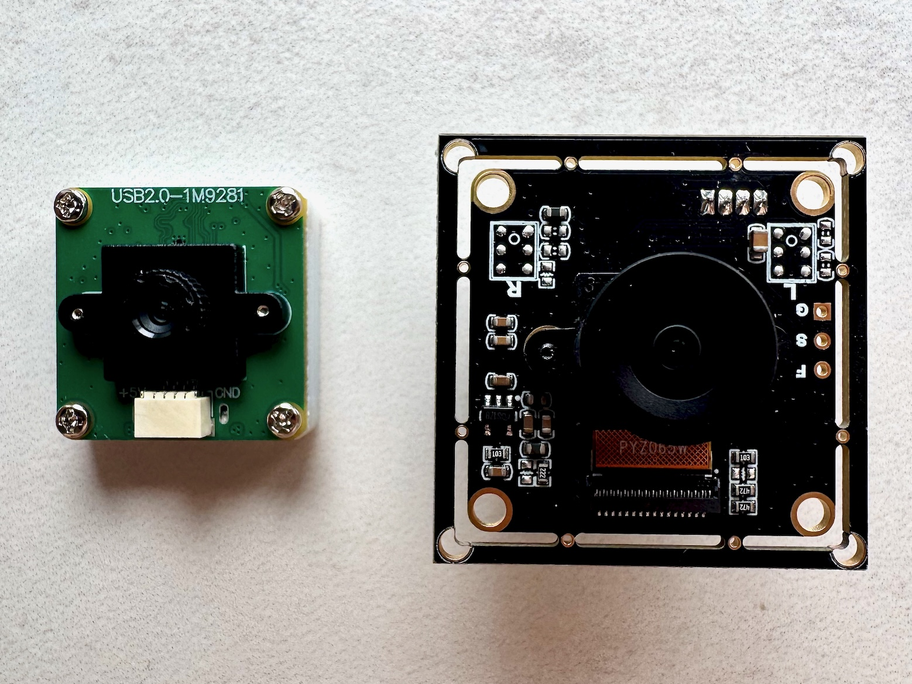
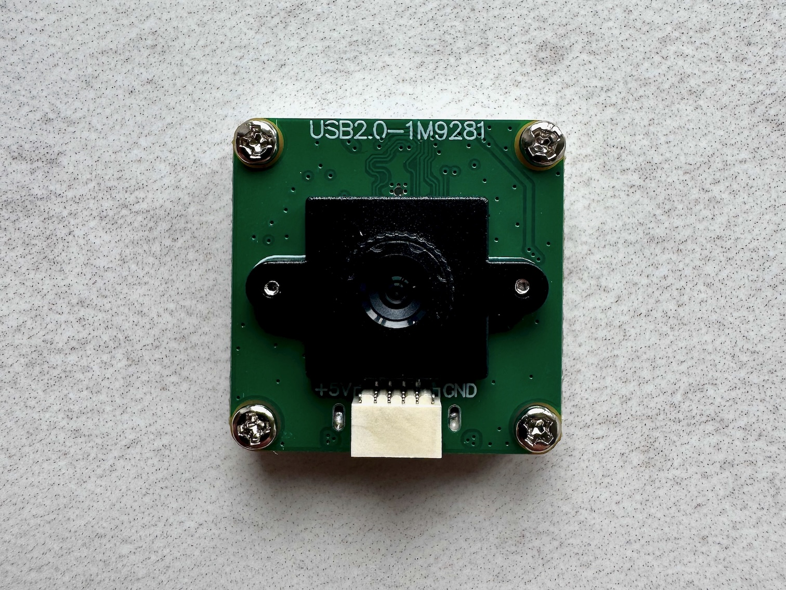
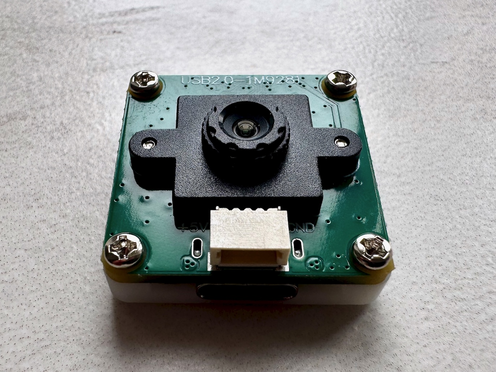
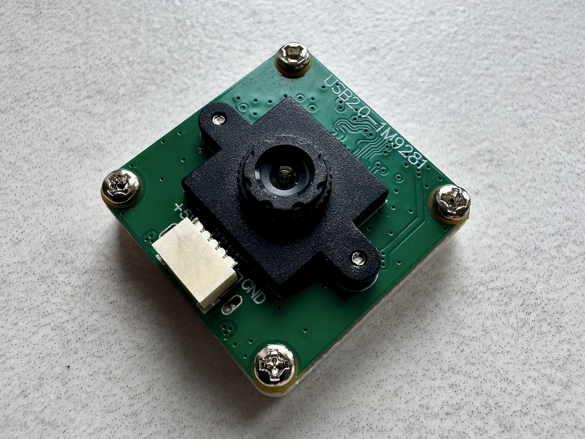
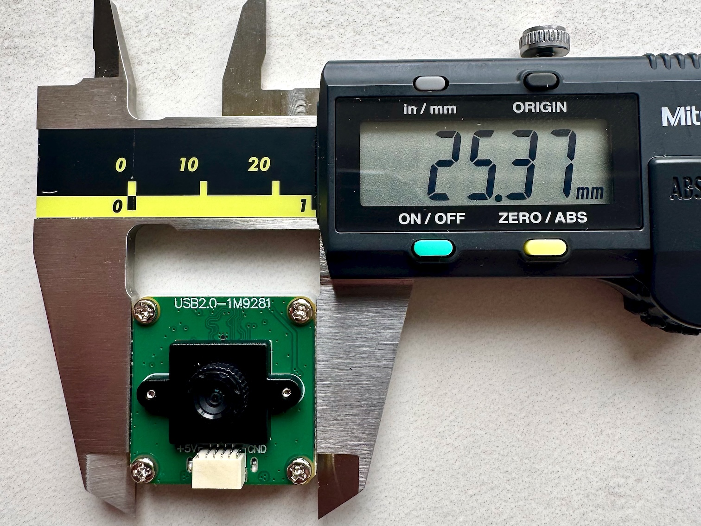
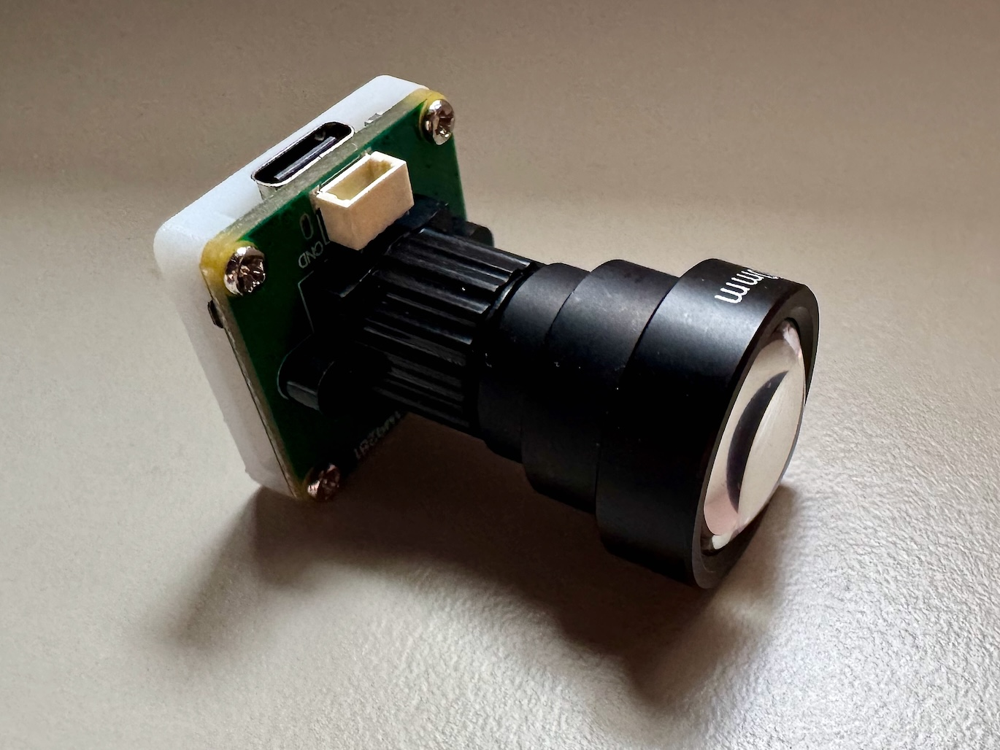
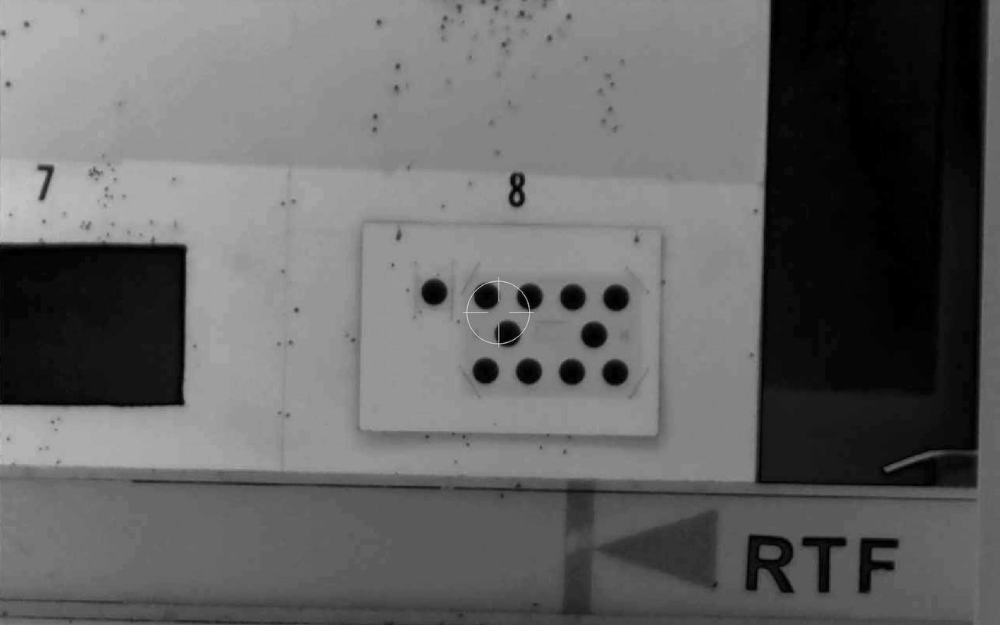

# Waveshare OV9281 (USB-C, Global Shutter)

| Field               | Value                                                 |
| ------------------- | ----------------------------------------------------- |
| Manufacturer        | Waveshare                                             |
| Model               | OV9281 1MP USB Camera (A) (SKU 31671)                 |
| Sensor / resolution | OV9281, 1280 x 800, monochrome, global shutter        |
| Connection          | USB-C (UVC, plug-and-play)                            |
| Frame rate          | Up to 120 fps @ 1280x800 MJPEG                        |
| Lens mount          | Stock: small non-M12 holder. Swap for an 18 mm hole-spacing M12 holder (as used on the Arducam) to fit standard M12 lenses. |
| Approximate price   | ~£25-30 + lenses                                      |
| Tested by           | [@dsgnr](https://github.com/dsgnr){:target="\_blank"} |

!!! info "Same sensor as the Arducam OV9281"
    This board uses the same OV9281 sensor as the
    [Arducam OV9281](./arducam-ov9281.md). Everything on that page about
    global shutter, monochrome sensitivity, frame rate, and lens choice
    applies here as well. This page focuses on what's different: the
    form factor and the connector.

## Why this one over the Arducam

Going forward this is the board I'm using. The sensor performance is
identical to the [Arducam OV9281](./arducam-ov9281.md), but the
Waveshare has two clear practical advantages:

- **Much smaller footprint.** The PCB is noticeably smaller (25mm square instead of 38mm)
  than the Arducam board.
- **USB-C connector on the board.** The Arducam has a USB-A cable with a PH connector
  that connects to the PCB. The Waveshare exposes a
  standard USB-C port directly on the board, so:
    - The cable is detachable, which makes routing, replacement, and
      transport a lot easier.
    - No PH connectors to source, crimp, or worry about pulling.
    - Any off-the-shelf USB-C cable works, so cable length is trivial
      to change without soldering or extra adapters/extenders

<figure markdown="span">
  
  <figcaption>Waveshare OV9281 (left/right) next to the Arducam OV9281 for scale</figcaption>
</figure>

## What it looks like

<figure markdown="span">
  
  <figcaption>Front of the board.</figcaption>
</figure>

<figure markdown="span">
  
  <figcaption>Profile view.</figcaption>
</figure>

<figure markdown="span">
  
  <figcaption>Alternate profile view.</figcaption>
</figure>

<figure markdown="span">
  
  <figcaption>Size reference, measured with digital calipers.</figcaption>
</figure>

## Lenses

!!! warning "Stock lens holder is not M12"
    Out of the box, the Waveshare ships with a much smaller lens and lens
    holder than the standard M12 mount used on the Arducam. The stock lens
    is fine as a wide-angle but you can't screw a standard M12 lens into it.

    The fix is straightforward: unscrew the stock holder from the PCB and
    replace it with an **18 mm hole-spacing M12 lens holder** (the same
    mounting pattern the Arducam board uses). Once swapped, any M12 lens
    from the Arducam tests fits directly.

Once the M12 holder is fitted, the lens tests on the
[Arducam OV9281](./arducam-ov9281.md#lenses-tried) apply here as well,
since the sensor is identical. The 50 mm M12 lens is currently the most
usable option at 25 yards.

<figure markdown="span">
  
  <figcaption>Waveshare OV9281 with the 18 mm hole-spacing M12 holder swapped in and the 50 mm M12 lens fitted.</figcaption>
</figure>

Preview through the 50 mm lens at 25 yards:

## 3D-printed case

Still to design. The Arducam case linked from the
[Arducam page](./arducam-ov9281.md#3d-printed-case) won't fit this
board because the PCB dimensions and connector location are different.
A new case that clamps to a Picatinny rail or Anschutz-style dovetail
is the plan.

## Still to do

- Design and print a case with a proper rail-compatible mounting
  interface (Picatinny or Anschutz dovetail).
- Mount on the rifle and capture initial test footage.
- Confirm identical detection behaviour to the Arducam board (expected,
  since the sensor is the same, but worth verifying end-to-end).
- Test at 50 m and 100 yards with NSRA targets.
- Measure the noise floor with the rifle clamped.
