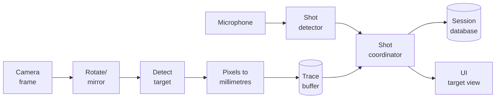

# How tracking works

This page explains how ShotTrainer turns camera images and microphone input into
a recorded aiming trace and shot position.

You do not need to understand the details to use the application, but the
information here may be useful if you are interested in how tracking and shot
registration work internally.

## What gets tracked

The camera is mounted to the rifle and points towards a fixed target.

As the rifle moves, the target appears to move within the camera image. By
measuring that movement frame by frame, ShotTrainer can calculate how the rifle
was being aimed over time.

Shots are detected independently using the microphone. When a shot is detected,
ShotTrainer finds the trace position that corresponds to the shot timestamp and
records it as the shot location.

### Coordinate system

The target view is centred on the aiming mark.

- Positive **X** values are to the right of centre.
- Positive **Y** values are below centre.

Because the target appears to move in the opposite direction to the rifle,
ShotTrainer automatically compensates for this so the displayed trace matches
the shooter's perspective.

For example, moving the rifle right produces a trace movement to the right, even
though the target itself moves left in the camera image.

## Tracking pipeline



## Step 1: Capture

ShotTrainer continuously receives images from the camera and timestamps each
frame as it arrives.

Camera capture runs independently of the user interface so that recording
continues smoothly even when the application is busy updating the display.

## Step 2: Apply camera transforms

Before tracking begins, any user-configured rotation or mirroring is applied.

These settings ensure that:

- The live preview matches the tracked image.
- Recorded traces match what was displayed during the session.
- Replays remain consistent with the original recording.

## Step 3: Detect the target

ShotTrainer searches each frame for the circular aiming mark.

Depending on image quality and contrast, it may use different detection
techniques internally, but the result is always the same:

- The centre of the aiming mark
- The diameter of the aiming mark
- A confidence value describing the quality of the detection

## Step 4: Convert to real-world coordinates

Once the aiming mark has been detected, ShotTrainer calculates a scale factor
using:

```text
Tracking circle diameter (mm)
÷
Detected circle diameter (pixels)
```

This produces a live millimetres-per-pixel conversion.

Using that scale, the software calculates the rifle's aim position relative to
the centre of the target and stores the result in both pixel and millimetre
coordinates.

## Step 5: Build the trace

Each position measurement becomes a tracking sample.

Samples are added to a rolling buffer that represents the rifle's movement over
time.

This buffer is continuously updated while recording.

## Step 6: Detect shots

At the same time, the microphone is monitored for shot sounds.

When the audio level exceeds the configured threshold:

1. A shot event is created.
2. The shot is timestamped.
3. A short lockout period prevents echoes from being counted as additional
   shots.

The threshold and lockout period can be adjusted in **Preferences > Audio**.

## Step 7: Match shots to trace data

When a shot is detected, ShotTrainer searches the trace buffer for the tracking
sample closest to the shot timestamp.

It then gathers the configured pre-shot and post-shot trace windows around that
point.

This produces the data used for:

- Shot placement
- Replay
- Hold analysis
- Tremor calculations
- Time-on-target statistics

## Step 8: Save the session

Tracking samples and shot events are written to the session database in the
background.

This allows recording to continue without waiting for disk operations.

The recorded data can later be used for replay, analysis, export, and
statistics.

## Threading

ShotTrainer performs camera capture and audio capture on separate worker
threads.

User interface updates are handled on the main application thread.

Keeping acquisition and display separate helps maintain smooth tracking and
responsive controls during recording.

## Current limitations

### Lens distortion and perspective

ShotTrainer does not currently compensate for camera lens distortion or
perspective effects.

For best results, the camera should be mounted approximately square to the
target.

### Timing precision

Audio and video devices do not share a common hardware clock.

ShotTrainer aligns the two streams as closely as practical, but timing
differences of a few milliseconds are normal.

### Trace smoothing

Tracking samples are stored exactly as they are produced by the detector.

No smoothing or filtering is applied to the recorded trace, allowing replay and
analysis tools to work from the original signal.

### Camera-to-bore offset

A rifle-mounted camera is not perfectly aligned with the bore axis.

As a result, there is usually a fixed offset between the camera's centre point
and the actual point of impact.

Use **Zero on aim** to compensate for this offset when shooting against a known
aiming point.
