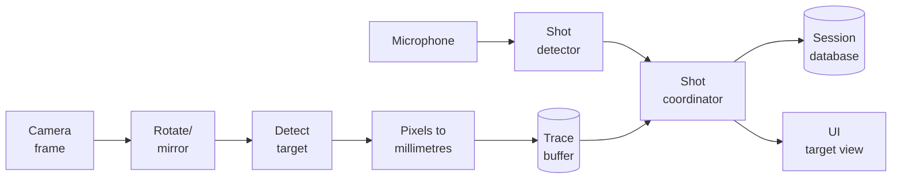

# How tracking works

A plain-language walkthrough of what happens between a frame leaving the
camera and a sample being recorded against a session.

## What gets tracked

The camera is mounted to the rifle, looking forward at a static paper
target. As you aim around the target, the rifle (and so the camera)
swings, which in turn moves where the target appears in the camera
frame. Detecting the target's position in each frame and tracking it
over time gives a trace of how the rifle is being held. The shot is
detected separately from audio, and the trace position at the shot
timestamp is the registered hit.

The trace's coordinate system is centred on the target. Positive X is
the rifle pointing right of centre, positive Y is below centre. That
means the *target's image* moves opposite to the aim, which we account
for in calibration so the displayed trace matches the user's aim
intuition.

## Pipeline at a glance

## Pipeline

1. **Capture.** `tracking/camera.py` runs a camera worker on its own thread.
   It reads frames from OpenCV, stamps each one with a monotonic clock
   timestamp at the moment the frame becomes available, and emits a
   `frame_ready` Qt signal. Capture is decoupled from rendering so the UI
   thread is never blocked waiting for a frame.

2. **Transform.** The controller applies the user's chosen rotation and
   mirroring (`tracking/frame_ops.py`). This is the only place these
   transforms live so the displayed frame, the tracked frame, and any
   recorded artefacts agree.

3. **Detect.** `tracking/detector.py` thresholds the frame, walks the
   contours, and scores each by circularity and how well it fills its
   minimum enclosing circle. The centroid is computed from image moments,
   which gives sub-pixel accuracy. Rather than picking the integer-pixel
   centre of the bounding shape, the detector uses the weighted mean of the
   contour area, which falls between pixels when the underlying mark does.

4. **Calibrate.** `tracking/calibration.py` converts the target's
   pixel position into millimetres on the target plane. The user shows
   a printed circle of known diameter to the camera. The app divides
   that diameter by the detected diameter in pixels to get a uniform
   mm-per-pixel scale and uses the circle's centre as the image-space
   origin. The mapping is set up so a rifle aim to the right (which
   moves the target left in the frame) reads as a positive-X
   displacement on the target view, matching how a shooter thinks about
   their hold.

5. **Track.** `tracking/tracker.py` packages the detection and the
   calibrated mm into a `TrackingSample`. If the user has enabled manual
   aim, the tracker substitutes a fixed pixel location instead. Either way
   the sample carries a confidence score (1.0 for a strong detection,
   lower for poor matches, 0.0 for manual aim).

6. **Buffer.** Samples land in a `TraceBuffer` (a bounded deque) so the
   shot coordinator can find the nearest sample by timestamp when a shot
   fires.

7. **Detect shots.** Concurrently, `audio/shot_detector.py` computes
   short-term RMS energy from microphone blocks, applies a one-pole DC
   blocker, and fires when the level crosses the user's threshold. A
   refractory window suppresses echoes. The shot timestamp is pinned to
   the loudest sample inside the block, then offset by the audio block
   start time.

8. **Coordinate.** When a shot event arrives, the shot coordinator looks
   up the nearest tracking sample by timestamp, slices a window of
   pre/post samples around it, and returns the result.

9. **Record.** The session recorder batches tracking samples into the
   SQLite database to keep IO out of the hot path. The shot row points at
   that timeline so replay can recover the exact window the shot
   coordinator used.

## Threads in one sentence

Camera capture and audio capture each run on their own thread. Detection,
buffering, and storage happen in those threads. Anything UI-facing crosses
back to the main thread via Qt's queued signals.

## Out of scope

- We don't try to compensate for camera lens distortion or perspective
  tilt. The single-circle calibration gives a uniform scale and origin
  only, which is enough for a roughly square-on, rail- or barrel-mounted
  camera.
- We don't synchronise the audio clock with the video clock to better
  than a few milliseconds. PortAudio gives no useful time stamp here.
- We don't filter or smooth the trace. Samples land as the detector
  produced them so analysis sees the raw signal.
- We don't model camera-bore parallax. With a rifle-mounted camera the
  optical axis isn't the bore axis, so there's a fixed offset between
  what the camera "aims at" and where the bullet goes. Calibration
  absorbs this when you zero against a known group.
