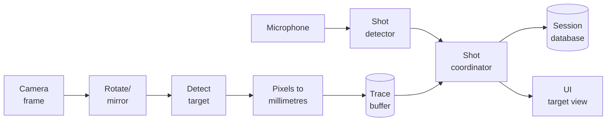

# How tracking works

A plain-language walkthrough of what happens between a frame leaving the
camera and a sample being recorded against a session.

## What gets tracked

The camera is mounted to the rifle, looking forward at a static paper
target. As you aim around the target, the rifle (and so the camera)
swings, which in turn moves where the target appears in the camera
frame. Detecting the target's position in each frame and tracking it
over time gives a trace of how the rifle is being held. The shot is
detected separately from audio, and the trace position at the shot
timestamp is the registered hit.

The trace's coordinate system is centred on the target. Positive X is
the rifle pointing right of centre, positive Y is below centre. That
means the *target's image* moves opposite to the aim. The pixel-to-mm
conversion accounts for that so the displayed trace matches the
user's aim intuition.

## Pipeline at a glance

## Pipeline

1. **Capture.** `tracking/camera.py` runs a camera worker on its own thread.
   It reads frames from OpenCV, stamps each one with a monotonic clock
   timestamp at the moment the frame becomes available, and emits a
   `frame_ready` Qt signal. Capture is decoupled from rendering so the UI
   thread is never blocked waiting for a frame.

2. **Transform.** The controller applies the user's chosen rotation and
   mirroring (`tracking/frame_ops.py`). This is the only place these
   transforms live so the displayed frame, the tracked frame, and any
   recorded artefacts agree.

3. **Detect.** `tracking/detector.py` finds the printed circle in the
   frame. It tries Hough circle detection first (`cv2.HoughCircles`),
   which works directly on the image gradients and is stable even when
   the target has scoring rings or internal white lines that would
   fragment a thresholded binary. If Hough doesn't find a circle in the
   allowed radius range (small targets, poor contrast), the detector
   falls back to adaptive thresholding, morphological closing to fill
   ring gaps, contour extraction, and scoring by circularity and fill.
   Either path produces a centre and radius in pixels.

4. **Track.** `tracking/tracker.py` converts the detection into a
   ``TrackingSample`` with both pixel and millimetre coordinates. The
   Diameter (mm) divided by detected diameter (px) gives a per-frame
   mm/px scale, and frame-centre minus circle-centre is the rifle's
   aim offset. The mapping is set up so a rifle aim to the right (which
   moves the target left in the frame) reads as a positive-X
   displacement on the target view, matching how a shooter thinks
   about their hold. The detector's confidence travels with the
   sample so downstream consumers can drop low-quality detections.

5. **Buffer.** Samples are stored in a `TraceBuffer` (a bounded deque) 
   so the shot coordinator can find the nearest sample by timestamp 
   when a shot fires.

6. **Detect shots.** Concurrently, `audio/shot_detector.py` computes
   short-term RMS energy from microphone blocks, applies a one-pole DC
   blocker, and fires when the level crosses the user's threshold. A
   refractory window suppresses echoes. The shot timestamp is pinned to
   the loudest sample inside the block, then offset by the audio block
   start time.

7. **Coordinate.** When a shot event arrives, the shot coordinator looks
   up the nearest tracking sample by timestamp, slices a window of
   pre/post samples around it, and returns the result.

8. **Record.** The session recorder batches tracking samples into the
   SQLite database to keep IO out of the hot path. The shot row points at
   that timeline so replay can recover the exact window the shot
   coordinator used.

## Threads in one sentence

Camera capture and audio capture each run on their own thread. Detection,
buffering, and storage happen in those threads. Anything UI-facing crosses
back to the main thread via Qt's queued signals.

## Out of scope

- No compensation for camera lens distortion or perspective tilt.
  The per-frame scale derived from the printed circle handles distance
  and zoom only. It assumes a roughly square-on, rail- or barrel-
  mounted camera.
- No synchronisation between the audio clock and the video clock to
  better than a few milliseconds. PortAudio gives no useful time stamp
  here.
- No filtering or smoothing of the trace coordinates between frames.
  Samples land as the detector produced them so analysis sees the raw
  signal. (The *radius* used for scaling is smoothed, separately.)
- No model of camera-bore parallax. With a rifle-mounted camera the
  optical axis isn't the bore axis, so there's a fixed offset between
  what the camera "aims at" and where the bullet goes. The "Zero on
  aim" button absorbs this when you zero against a known aim point.
