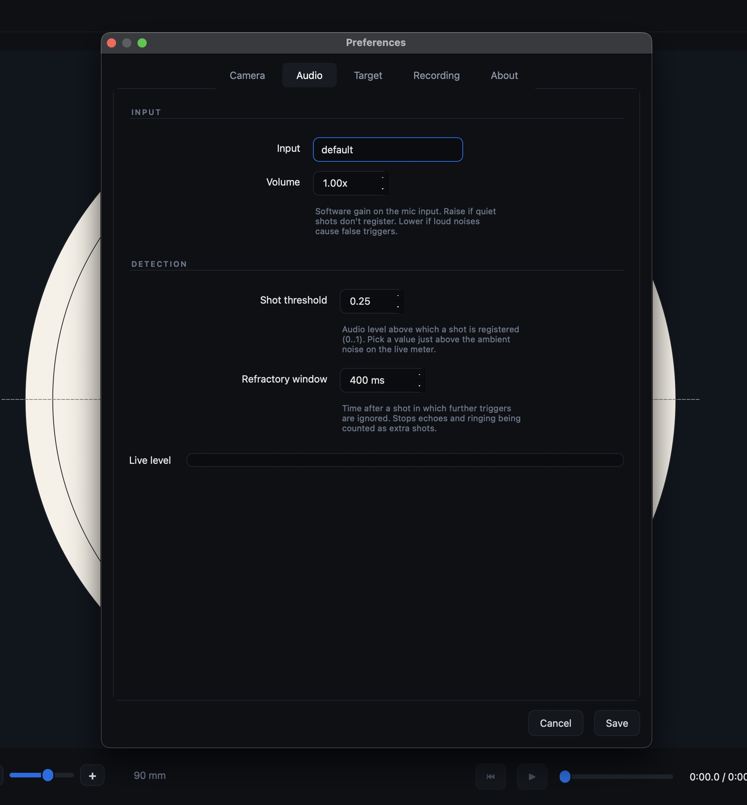
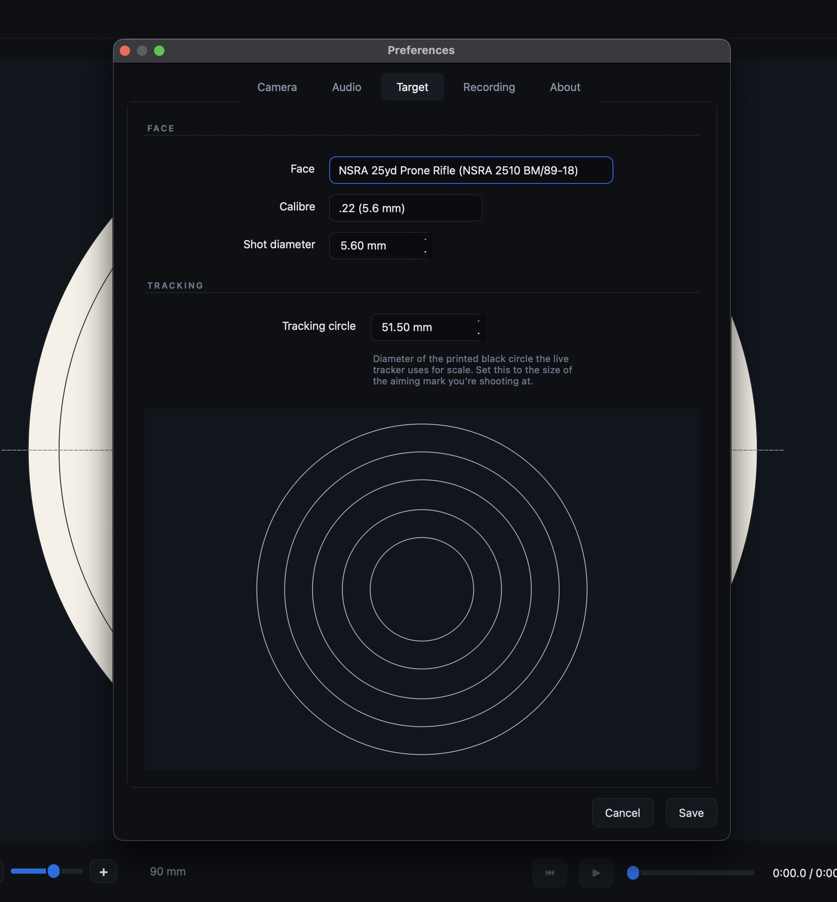
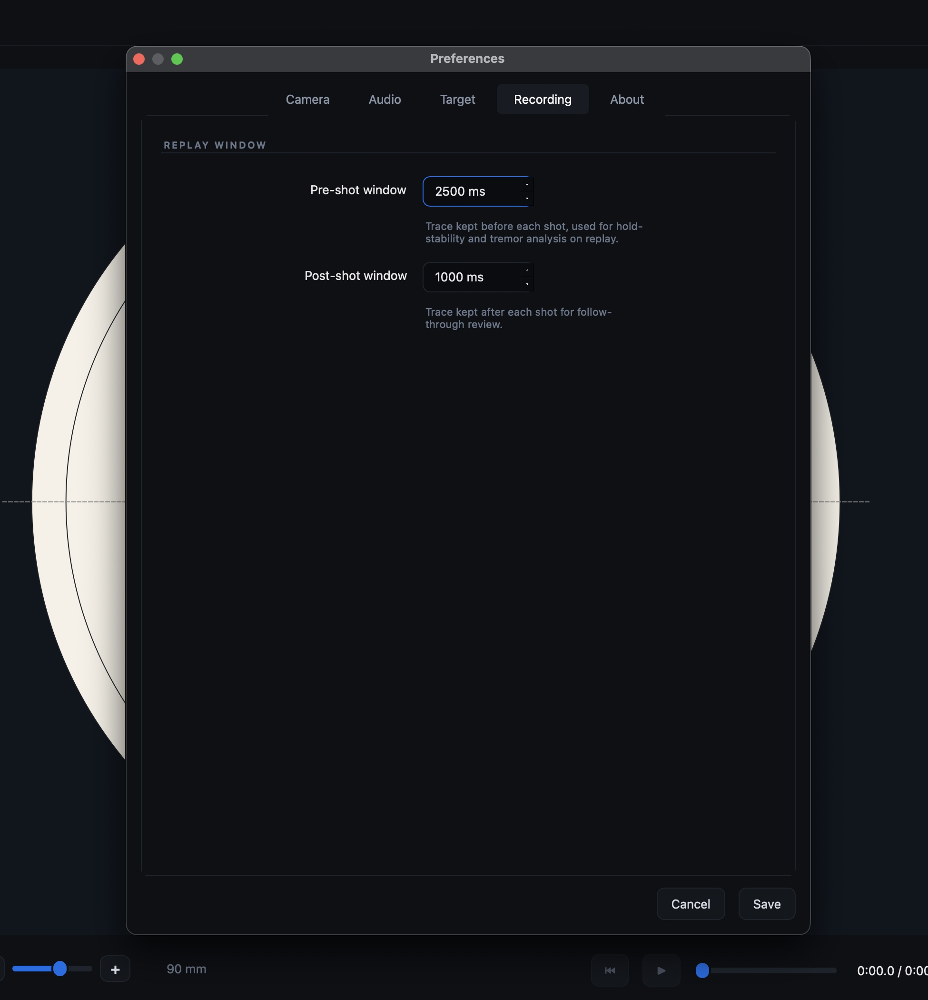

# Preferences reference

Open the Preferences dialog from **Tools > Preferences...**.

Most camera-related settings are applied immediately so you can see the effect
in the live preview. Click **Save** to keep your changes, or **Cancel** to
restore the previous settings.

## Camera tab

### Device

#### Camera

Select the camera ShotTrainer should use for tracking.

If you connect a camera after the application has started, click **Refresh** to
update the device list.

#### Rotation

Rotates the camera image by 0°, 90°, 180°, or 270°.

This is useful when the camera is mounted sideways or upside down.

#### Mirror

Flips the image horizontally, vertically, or both.

Use this if the camera orientation causes the preview image to appear reversed.

#### Invert trace

Inverts the reported aim position independently of the image itself.

This setting is useful when optical components such as mirrors, prisms, or
magnifiers reverse the relationship between image movement and aim movement.

### Tracking

#### Tracking region

Controls how much of the camera image is searched for the tracking circle.

Smaller values restrict tracking to the centre of the image and can help prevent
false detections from dark objects near the edges of the frame.

Range: **0.1 to 1.0**

### Image

#### Brightness

Adjusts image brightness before tracking is performed.

Increase this value if the camera image is too dark.

Range: **-100 to +100**

#### Contrast

Adjusts image contrast before tracking is performed.

Increasing contrast can help the detector distinguish the tracking circle from
the background.

Range: **0.5× to 2.0×**

#### Auto-optimise tracking

Automatically searches for brightness and contrast settings that provide the
clearest tracking signal.

The result is displayed next to the button when the optimisation completes.

#### Reset

Restores brightness and contrast to their default values.

### Live preview

A live camera preview is displayed at the bottom of the tab.

The tracking region is shown as an overlay so you can see exactly which part of
the image is being analysed.

Use the **Expand** button in the top-right corner of the preview to open a
larger floating preview window.

## Audio tab

### Input

#### Microphone

Select the microphone used for shot detection.

Choosing **Default** uses the operating system's default recording device.

#### Volume

Applies software gain to the incoming microphone signal.

Increase this value if shots are not reaching the detection threshold.

Range: **0.1× to 10.0×**

### Detection

#### Shot threshold

The audio level required for a sound to be recognised as a shot.

Set the threshold slightly above the normal background noise level shown on the
live meter.

Range: **0.0 to 1.0**

#### Refractory window

The minimum time between detected shots.

Any sounds occurring within this period after a detected shot are ignored.

This helps prevent echoes, reverberation, or mechanical noise from being counted
as additional shots.

Range: **50 to 5000 ms**

### Level meter

A live audio meter at the bottom of the tab shows the current microphone level.

A marker on the meter indicates the current shot threshold, making it easy to
see how much headroom is available.

## Target tab

### Face

#### Face

Select the target face used for scoring.

ShotTrainer includes a number of built-in target faces, and additional custom
faces can be installed. See [Using federation targets](provided-targets.md) for
details.

#### Calibre

Provides common projectile diameter presets.

Selecting a calibre automatically updates the shot diameter setting.

#### Shot diameter

The diameter of the projectile used for scoring calculations.

A larger diameter increases the chance of a shot touching a higher-value scoring
ring.

### Tracking

#### Tracking circle

The real-world diameter of the aiming mark or marker sheet used for tracking.

This value is used to convert camera measurements into millimetres and should
match the diameter of the printed marker sheet or the target's black aiming
mark.

### Face preview

A preview beneath the controls shows the scoring rings for the currently
selected target face.

The preview updates automatically when a different face is selected.

## Recording tab

### Pre-shot window

The amount of trace data retained before a shot is detected.

This data is used for hold analysis, tremor calculations, and replay.

Range: **0 to 10,000 ms**

### Post-shot window

The amount of trace data retained after a shot is detected.

This data is used for follow-through analysis and replay.

Range: **0 to 10,000 ms**
