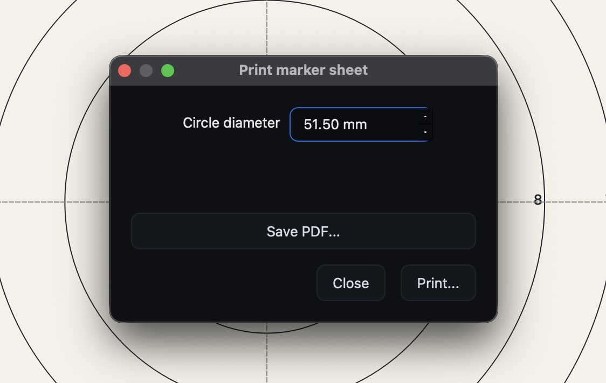

# Printing a marker sheet

The marker sheet provides a simple, high-contrast aiming mark that ShotTrainer
can track reliably.

By knowing the real-world diameter of the printed circle and measuring its size
in the camera image, ShotTrainer can convert movement on screen into millimetres
on the target.

## Opening the marker sheet dialog

Open the marker sheet dialog from:

**Tools > Print marker sheet...**

## Choosing a diameter

Enter the diameter of the circle you want to print, measured in millimetres.

Ideally, this should match the size of the aiming mark you will be shooting at.
For example, if your target has a black aiming mark that is 45.5 mm in diameter,
print a 45.5 mm marker sheet.

The default diameter is **60 mm**, which works well for general-purpose testing
and short-range setups.

## Printing or saving as PDF

The dialog provides two output options.

### Print

Click **Print...** to send the marker sheet directly to a connected printer
using your operating system's print dialog.

### Save PDF

Click **Save PDF...** to create a PDF version of the marker sheet that can be
printed later or taken to a print shop.

## Tracking circle diameter

The marker sheet diameter is linked directly to the tracking circle diameter
setting found in:

**Preferences > Target > Tracking circle**

Both settings represent the same value.

Changing the diameter in either location automatically updates the other. If you
print a 50 mm marker sheet, the tracking circle diameter should also be set to
50 mm.

## Printing tips

### Use matte paper

Matte paper generally produces more reliable tracking than glossy paper, which
can create reflections and glare.

### Print at actual size

Many printer drivers apply automatic scaling by default.

To ensure accurate measurements:

- Disable any "Fit to page" option
- Select **100% scale** or **Actual size** where available

The printed circle should match the diameter shown in the dialog.

### Check the printed size

After printing, measure the circle with a ruler or calipers.

If the printed diameter differs significantly from the requested size, adjust
the printer settings and print again.

Tracking accuracy depends on the printed circle matching the configured
diameter.

### Mount the sheet flat

Try to keep the marker sheet as flat as possible.

Wrinkles, folds, or curled paper can slightly change the apparent size and shape
of the circle, reducing measurement accuracy.

Pin or tape the sheet securely before use.
