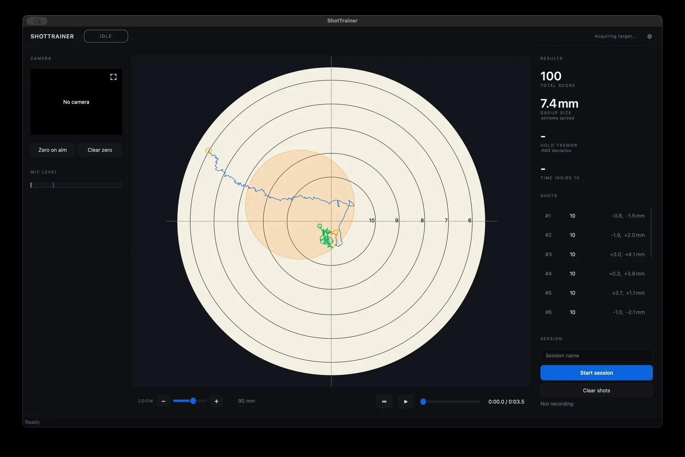

# Shot replay



Shot replay allows you to examine the aiming trace recorded around an individual
shot. By stepping through the trace, you can see how the rifle moved before the
shot, at the moment the shot broke, and during follow-through.

## Opening a replay

To replay a shot, click any shot in the shot list.

The target view switches from the live display to the recorded trace for that
shot, and the replay controls become available.

## Understanding the trace

The replay trace is divided into three coloured sections, making it easy to
identify what happened during each stage of the shot.

### Blue - Approach

The approach phase covers the beginning of the pre-shot window through to the
point where the aim settles onto the target.

This section shows how the rifle was brought into position and how consistently
the aim settled before the shot.

### Amber - Shot execution

The amber section represents the final moments before the shot breaks.

This is often the most useful part of the trace when analysing hold quality,
trigger timing, and shot execution.

### Green - Follow-through

The follow-through phase begins immediately after the shot and continues until
the end of the post-shot window.

A smooth follow-through can indicate good shot execution, while sudden movement
may reveal a flinch or disturbance during the shot.

## Replay controls

| Control           | Action                                   |
| ----------------- | ---------------------------------------- |
| ▶ / ⏸ (**Space**) | Play or pause the replay at normal speed |
| ⏮ Reset          | Return to the start of the replay        |
| Slider            | Move to any point in the trace           |

You can drag the slider to inspect any moment within the recorded window.

## Time display

The time display beside the slider shows the current replay position and the
total replay duration.

For example:

```text
1:02.3 / 2:03.0
```

The total duration is determined by the pre-shot and post-shot recording windows
configured in **Preferences > Recording**.

## What replay can tell you

Replay is one of the most useful tools for understanding how a shot was
executed.

### Hold quality

A tight, consistent trace generally indicates a stable hold, while a larger or
more erratic trace may suggest instability or excessive movement.

### Trigger timing

Replay makes it possible to see whether the shot broke during a stable hold or
while the rifle was still moving across the target.

### Follow-through

The movement after the shot can reveal whether the rifle remained stable through
the shot or whether there was a flinch, anticipation, or other disturbance.

Studying follow-through is often just as valuable as analysing the hold before
the shot.
