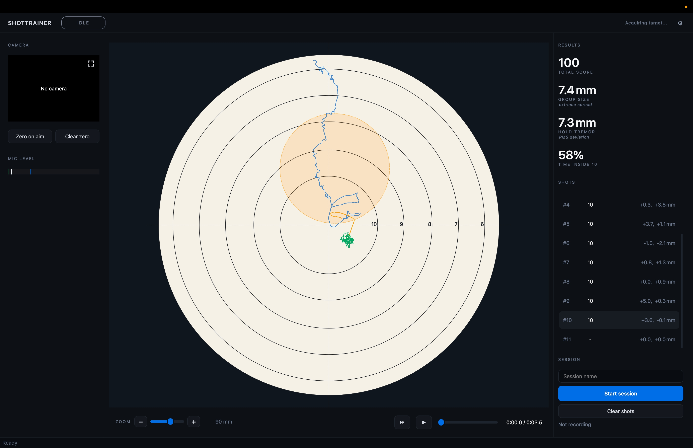

# How shot scoring works

ShotTrainer calculates a score for each shot using the currently selected target
face. The scoring rules are designed to match the way paper targets are scored
in competition.

Depending on the target definition, a shot that touches a scoring line may count
as either the higher or lower score. This behaviour is controlled by the target
face and supports both inward and outward scoring systems.

## How scores are calculated

Each target face defines a set of scoring rings and a shot diameter.

To score a shot, ShotTrainer measures the distance from the centre of the target
to the centre of the shot, then determines which scoring ring the shot reaches.

The scorer works from the highest-value ring outward. The first ring touched by
the shot determines the score.

Because the projectile has a physical size, scoring is based on the **outer
edge** of the shot rather than its centre. If the edge of the shot touches a
higher-value scoring ring, the shot receives that score.

This matches the scoring method used by organisations such as ISSF and NSRA.

## Shot diameter and calibre

The shot diameter setting determines how large the projectile is for scoring
purposes.

You can configure this in:

**Preferences > Target > Shot diameter**

A larger diameter means the shot can reach a scoring line from slightly further
away, which can affect close scoring decisions.

Common values include:

- **4.5 mm** for air rifle and air pistol pellets
- **5.6 mm** for .22 LR ammunition

You can also enter a custom diameter if required.

## X-ring scoring

Many target faces include an **X-ring** at the centre of the target.

Shots that land in the X-ring are displayed as **X** rather than **10**.

For scoring totals, an X counts as 10 points. For example, ten Xs still produce
a total score of 100.

The X count is commonly used as a tiebreaker in competitions and does not award
additional points.

## Target faces

ShotTrainer includes target faces for a range of common disciplines, including
air rifle and smallbore shooting.

You can also create your own target definitions.

For details of the built-in faces and custom face format, see
[Provided targets](provided-targets.md).

## Re-scoring a session

Changing the selected target face does not automatically change the scores
stored with an existing session.

To calculate scores using a different face, choose:

**Tools > Re-score with current face**

All shots currently loaded in the main window are re-evaluated using the active
target face, and the updated scores are shown immediately in the shot list and
statistics panel.

Re-scoring only affects the current view. The original session data stored in
the database is not modified, so reopening the session later restores the
original scores.

## When no target face is available

If no target face is selected, or the selected face cannot be loaded,
ShotTrainer cannot calculate scores.

Shots will still appear on the target view, but:

- The score column displays `-`
- No total score is shown
- Score-based statistics are unavailable

Once a valid target face is selected, scores can be calculated again.
