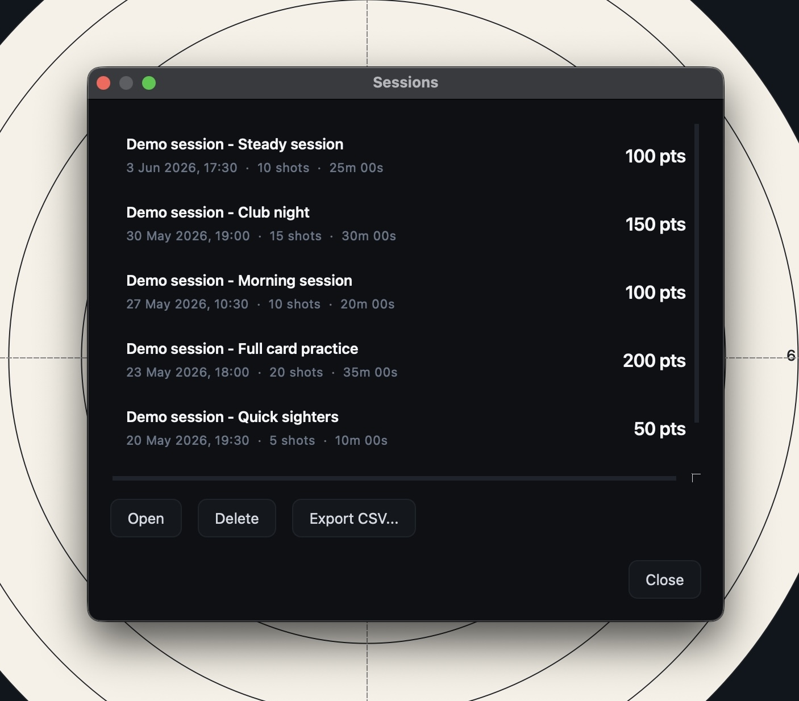

# Session history and export

The session browser lets you view, replay, export, and manage previously
recorded sessions.

Open any session to review your shots, export the data for further analysis, or
remove sessions you no longer need.

## Opening the session browser

Open the session browser from **File > Sessions...**.

## Session list

Each row represents a recorded session and shows:

- The session name
- The date and time the session started
- The number of shots recorded
- The session duration
- A category icon (target for practice, crosshair for sighter, star for match)
- A score badge, when scored shots are available

If a session was not given a name, ShotTrainer displays a generated name such as
**Session #3**.

## Filtering the list

The search field at the top of the dialog matches against session names as you
type. The category dropdown next to it narrows the list to one of practice,
sighter, or match. Both filters can be combined.

Clear the search field (or pick **All categories**) to see every session
again.

## Opening a session

To load a session for review:

- Select the session and click **Open**
- Or double-click the session in the list

The session's shots are loaded into the main window, allowing you to inspect the
group, replay individual shots, and review trace data.

## Exporting a session

To export a session:

1. Select the session.
2. Click **Export CSV...**
3. Choose a destination folder.

ShotTrainer creates two CSV files.

### Shot data

`session_<id>_shots.csv`

Contains one row per shot with the following fields:

- Shot index
- Timestamp
- X position (mm)
- Y position (mm)
- Audio level
- Detection confidence
- Score

### Trace data

`session_<id>_trace.csv`

Contains the full recorded trace for the session, including:

- Timestamp
- X position (pixels)
- Y position (pixels)
- X position (mm)
- Y position (mm)
- Tracking confidence
- Frame ID

Numeric values are written using fixed decimal precision to ensure they display
cleanly in spreadsheet applications.

## Renaming a session

To change the name of a saved session:

1. Select the session.
2. Click **Rename...**
3. Type the new name and press OK.

Leaving the field blank clears the name back to the default **Session #N**
display. The change is saved immediately.

## Changing the category

Each session is tagged as practice, sighter, or match. To change the tag on a
saved session:

1. Select the session.
2. Click **Category...**
3. Pick a different value and press OK.

The new tag is saved immediately and the badge on the row updates.

## Deleting a session

To permanently remove a session:

1. Select the session.
2. Click **Delete**.
3. Confirm the deletion.

Deleting a session removes the session record, all associated shots, and all
trace data. This action cannot be undone.

## No sessions yet

If no sessions have been recorded, the browser displays a message explaining how
to get started.

Create your first session using the green **Start session** button on the main
window or by pressing **Ctrl+S** (**Cmd+S** on macOS).
