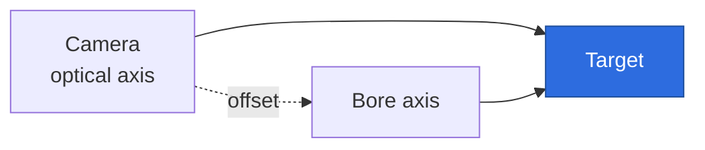
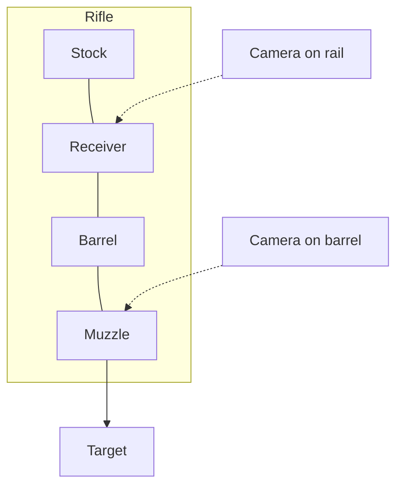
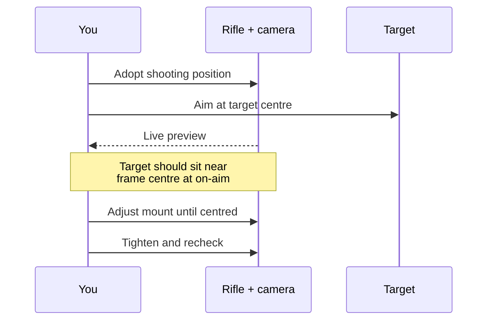

# Setup and camera alignment

Practical guide for getting the camera mounted on the rifle, lined up
with the bore, and pointed at the target so the trace and the shot
both land in sensible places.

## The shape of the problem

The bullet leaves the bore. The camera's optical axis is offset from
the bore by however far apart the two are physically (typically a few
centimetres above or to the side). Both axes ultimately need to point
at the same target, but they don't have to be perfectly parallel.
Anything imperfect in the alignment becomes a fixed offset between
the trace and the actual point of impact, and the **Zero on aim**
button absorbs that offset.

What you actually need:

1. The camera moves with the rifle (no flex, no slip).
2. The camera sees the target plainly when you're on aim.
3. The trace direction matches your aim direction.
4. The fixed offset between trace and impact is small enough that
   "Zero on aim" handles it.

## Mounting the camera

### Where to put it

Two practical positions:

- **On the barrel.** A rail clamp or 3D-printed cradle around the
  barrel near the muzzle. Best line-of-sight to the target. Most
  affected by barrel heating, recoil flex.
- **On the stock or scope rail.** A Picatinny / dovetail rail mount
  on top of the receiver or under the stock. More stable than barrel
  mounts, but the camera looks past the bore at a small angle that
  must be accounted for at the target.

Whichever you choose, the camera should be:

- Rigid relative to the rifle. A loose mount is the single biggest
  cause of unexplained trace noise.
- Roughly above or below the bore rather than off to the side, so
  the offset is in one axis only and easier to reason about.
- Aimed forward, with the target near the centre of the frame when
  you're on aim.

### Wiring

Route the USB cable along the stock with cable ties or tape so it can't
tug on the camera as the rifle moves. A coiled cable that lifts off
the rifle as the muzzle rises will show up in the trace.

## Aligning camera to bore

You don't need a laser bore-sight rig. The procedure that works:

1. Set the rifle up at the firing point in your normal stance.
2. Aim the rifle at the centre of the target through the iron sights
   or scope, exactly as you would for a shot. Hold steady.
3. Look at the live preview from the camera. The target should be
   somewhere in the central third of the frame.
4. Adjust the camera mount so the target's centre sits roughly at the
   centre of the frame at this on-aim position. You don't need
   pixel-perfect, you just need it not to drift to the edge during a
   normal hold.
5. Tighten the mount and check the live preview again. Any movement
   between "loose" and "tight" tells you the mount has play. Fix
   that before going further.

### When you can't get it perfect

You usually can't, and that's fine. The live target image only needs
to stay inside the central tracking region during a normal hold (see
the Tracking region setting in Preferences). If the on-aim image is
slightly off-centre:

- **Off by less than 1/4 of the frame.** Leave it. The "Zero on aim"
  workflow (see below) makes the on-aim point read as (0, 0) so the
  trace coordinates are correct relative to where the rifle points.
- **Off by more than 1/4 of the frame.** The hold motion may push the
  target outside the tracking region during natural wobble. Either
  reseat the mount, widen the tracking region in Preferences, or
  reframe by adjusting the camera angle.
- **Trace direction is opposite to aim.** Open Preferences > Camera
  and toggle the horizontal mirror. A barrel-mounted camera mounted
  the other way up flips left-right relative to the shooter. The
  preview makes this obvious.
- **Trace is rotated.** Use the Rotation drop-down in Preferences to
  pick 90, 180, or 270 degrees. This is common when the camera body
  was clamped sideways for clearance.

## Setting the tracking circle diameter

Once the camera is mounted and aligned, the only spatial parameter to
set is the diameter of the printed black circle the live tracker
measures against. There is no calibration step: every frame derives
the mm/px scale from the detected radius and this diameter, so a small
distance change after setting it self-corrects on the next frame.

1. Print the marker sheet from `Tools > Print marker sheet`.
2. Pin it at the target distance, in the same plane the target will
   sit in.
3. Open `Preferences > Target > Tracking circle` and set the diameter
   to the value you just printed (the marker-sheet dialog updates this
   automatically when you close it, so this is mostly a sanity check).

The camera-to-bore offset doesn't enter the conversion: the live
tracker reports millimetres on the target plane.

## Zeroing the trace to your aim

The camera's optical axis isn't the bore axis, so the trace's origin
(the centre of the printed circle) usually isn't where the rifle is
actually pointing when you're on aim. The "Zero on aim" button in the
left column locks the current aim point as the trace's (0, 0) so the
trace and shot marks line up with where the rifle is really pointing.

Two ways to use it:

- **Zero to your aim.** Adopt your shooting position, hold the sights
  on the target's centre, and press **Zero on aim**. The trace now
  reads "where the rifle is pointing relative to the centre of the
  target". The offset is saved automatically and survives restarts.
- **Zero to a known group.** Fire a small group (3 to 5 shots) with
  the rifle zeroed normally. If the group centre is a few millimetres
  off the target centre, hold the rifle on the *group centre* in your
  natural shooting position and press **Zero on aim**. Subsequent
  shots will register relative to where the bullets actually land.

If you ever want to revert the origin to the printed circle's centre
(for example if you re-mount the camera), press **Clear zero**. The
button is enabled only while an offset is in effect. The tooltip on
**Zero on aim** shows the current offset value when one is set.
shows the current offset values so you can sanity check them.

For dry-fire practice the bullet-impact part of the second workflow
doesn't apply. Just zero to your aim and the trace will read in
"distance from intended aim point" coordinates.

## Sanity checks

After setup, before recording sessions:

- Move the muzzle by a small known amount (a few centimetres at the
  target plane) and watch the trace move by the same amount.
- Tap the rifle gently. The trace should jump and then settle, not
  drift away.
- Cover the lens. The detector should report tracking lost, not lock
  onto a different blob.
- Fire one shot. The shot mark should appear inside the recorded
  hold zone, not somewhere else entirely.

If any of these fail, revisit the mount before tuning the tracking
circle diameter or detector settings.
