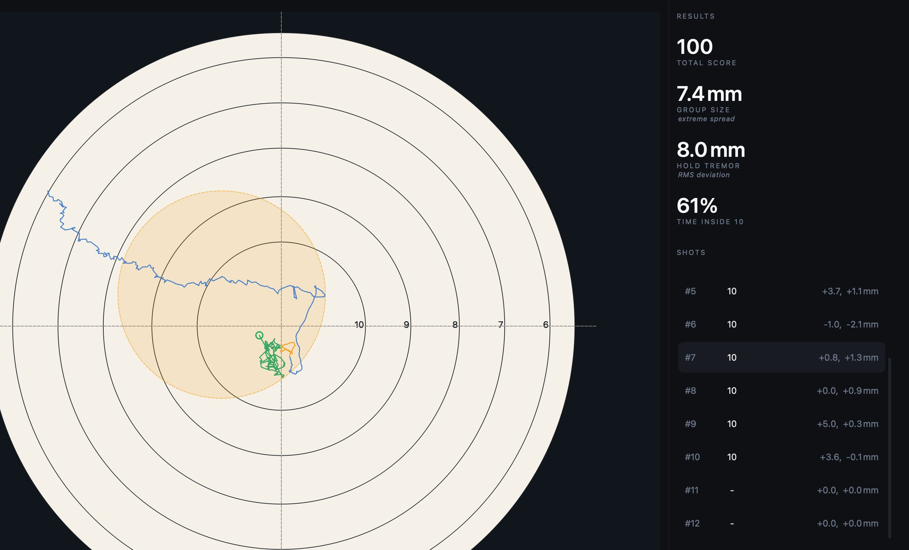

# Understanding the stats panel

The stats panel sits on the right-hand side of the main window and provides a
quick summary of your performance. During a live session the values update as
shots are recorded. In replay mode they update as you move between shots.

## Total score

The combined score for all shots in the current view.

Shots are scored using the active target face. An X counts as 10 points. Misses
and unscored shots are not included in the total.

If no shots have a score, the panel shows the number of shots instead.

## Group size

Group size is the **extreme spread** of the group: the distance between the two
shots that are furthest apart, measured centre-to-centre in millimetres.

This is the figure most shooters use when describing a group.

Hover over the value to see the group's **mean radius**, which measures how
tightly shots cluster around the group's centre.

## Hold tremor

Hold tremor shows how steady the rifle was before the shot broke.

It is calculated from the pre-shot trace and reported as an RMS (root mean
square) deviation in millimetres. Lower values indicate a steadier hold.

During a live session, the value reflects the most recent shot. In replay mode,
it updates for the selected shot.

## Time on target

Time on target shows how much of the pre-shot aiming period was spent inside the
target's highest scoring ring.

The percentage is calculated from the pre-shot trace and provides a simple
indication of how consistently the aim remained in the centre of the target.

The label beneath the value identifies the ring being used, for example **Time
Inside X** or **Time Inside 10**.

## When the values update

### Live session

- **Total score** updates after each shot.
- **Group size** updates as the group grows.
- **Hold tremor** reflects the most recent shot.
- **Time on target** reflects the most recent shot.

### Replay

- **Total score** and **group size** reflect the shots currently loaded in the
  replay.
- **Hold tremor** and **time on target** update for the selected shot.
